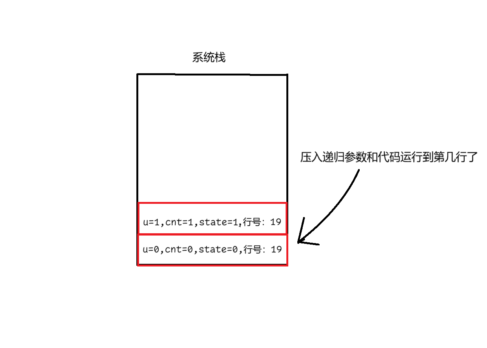
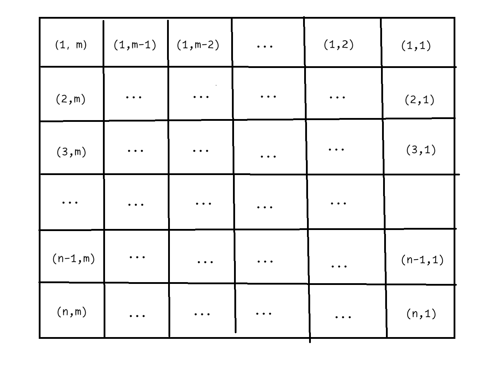
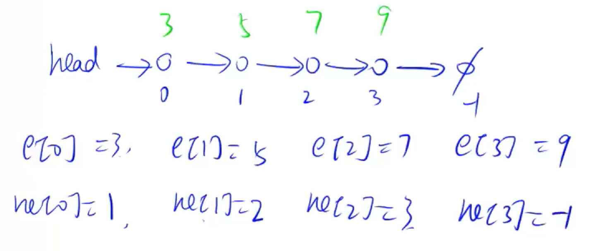
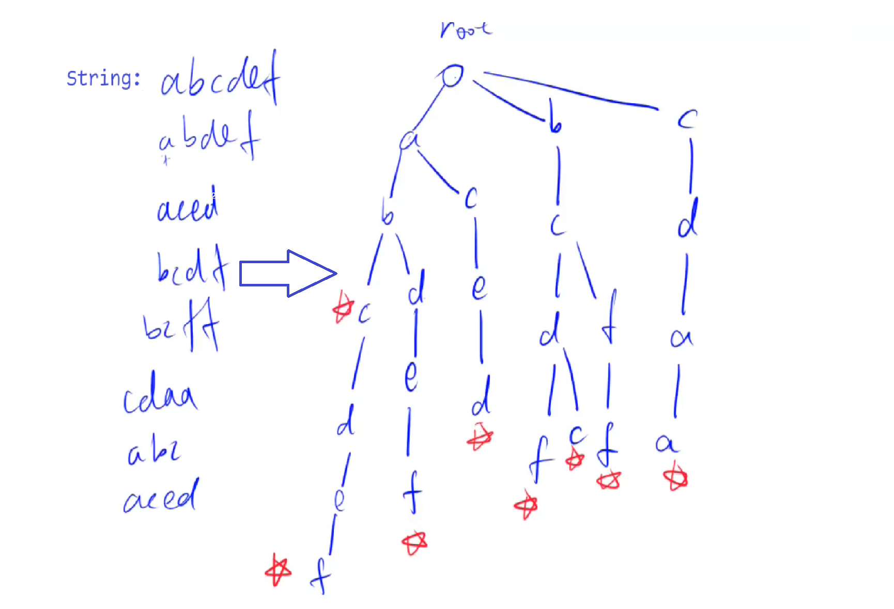
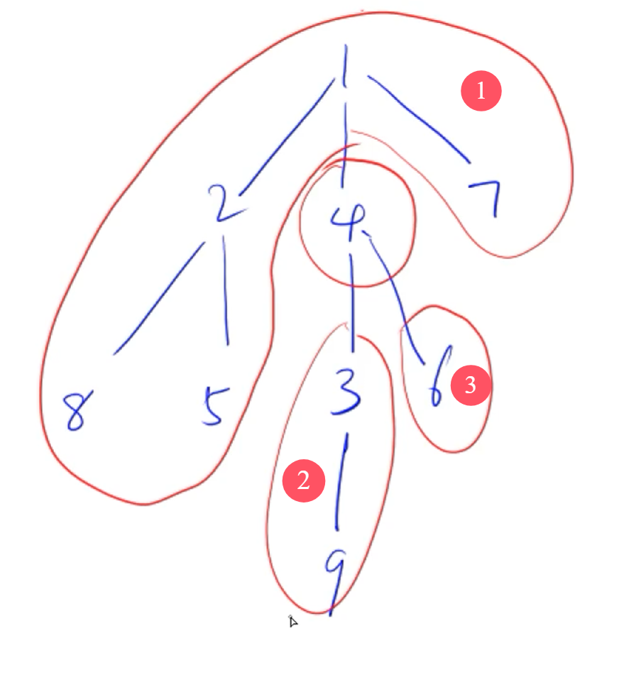
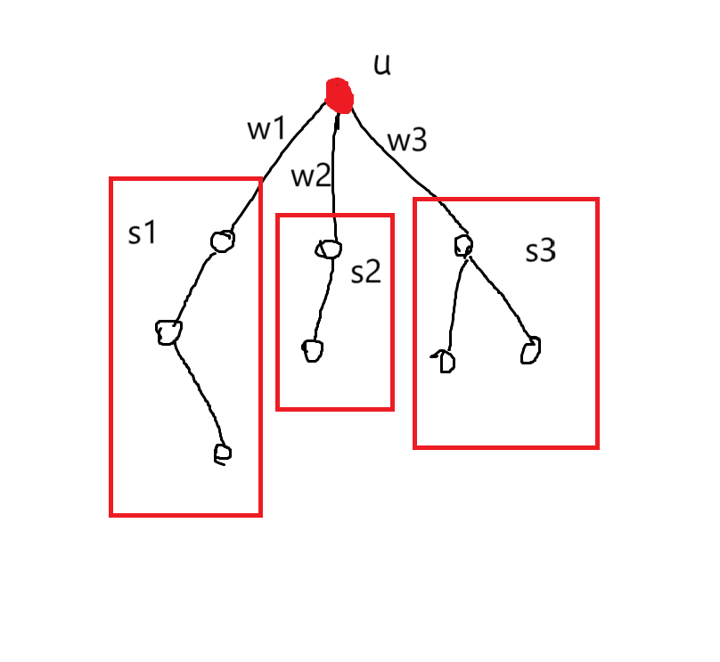
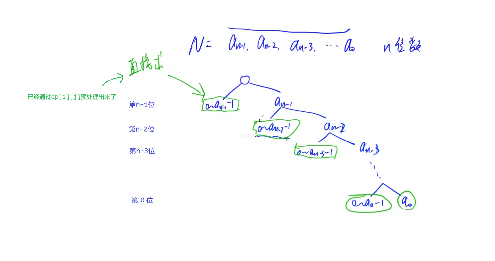
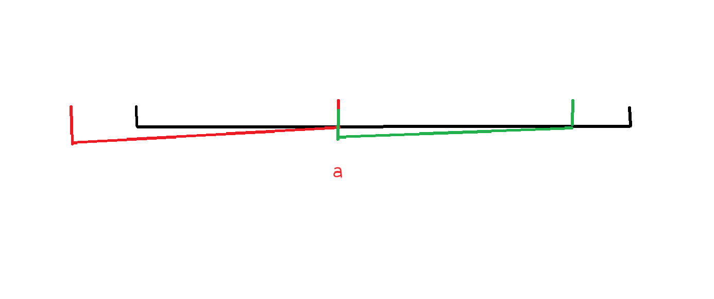

**注意**：有三级标题的知识点说明已经学完，如果只有二级标题说明这个知识点还未收录经典题目进行整理学习，敬请期待...

题目格式模板：

### AcWing

#### 题目描述

>### 1064. 小国王
>
>xxx
>
>#### 输入格式
>
>xxx
>
>#### 输出格式
>
>xxx
>
>#### 数据范围
>
>$0<N≤1000$
>
>#### 输入样例：
>
>```
>
>```
>
>##### 输出样例：
>
>---
>
>#### 算法设计
>
>xxx
>
>#### 完整 C++ 代码
>
>```c++
>
>```
>
>xxx
>
>

#### 算法设计

xxx

#### 完整 C++ 代码

```c++

```

xxx


# 第一章 基础算法


## 二分查找

### AcWing 789. 数的范围

#### 题目描述

>给定一个按照升序排列的长度为 $n$ 的整数数组，以及 $q$ 个查询。
>
>对于每个查询，返回一个元素 $k$ 的起始位置和终止位置（位置从 $0$ 开始计数）。
>
>如果数组中不存在该元素，则返回 `-1 -1`。
>
>#### 输入格式
>
>第一行包含整数 $n$ 和 $q$，表示数组长度和询问个数。
>
>第二行包含 $n$ 个整数（均在 $1∼10000$ 范围内），表示完整数组。
>
>接下来 $q$ 行，每行包含一个整数 $k$，表示一个询问元素。
>
>#### 输出格式
>
>共 $q$ 行，每行包含两个整数，表示所求元素的起始位置和终止位置。
>
>如果数组中不存在该元素，则返回 `-1 -1`。
>
>#### 数据范围
>
>$1≤n≤100000$
>
>$1≤q≤10000$
>
>$1≤k≤10000$
>
>#### 输入样例：
>
>```
>6 3
>1 2 2 3 3 4
>3
>4
>5
>```
>
>#### 输出样例：
>
>```
>3 4
>5 5
>-1 -1
>```

#### 算法设计

一般的二分查找问题其实都可以抽象成一个更具体的问题：如何满足条件的第一次出现和最后一次出现的元素下标？

下面我们给出模板：

```c++
bool check(int x)
{
	// 坚持元素x是否满足条件
}

// 模板1：求满足条件的第一次出现的元素下标
int bsearch_1(int* a, int l, int r)
{
	while (l < r)
	{
		int mid = l + r >> 1;
		if (check(a[mid]))
        	r = mid;
		else l = mid + 1;
	}
	return l;
}

// 模板2：求满足条件的最后一次出现的元素下标
int bsearch_2(int* a, int l, int r)
{
	while (l < r)
	{
		int mid = l + r + 1 >> 1;     // 这里要+1是因为l=mid，如何l+r>>1可能还是l，会死循环
		if (check(a[mid]))
			l = mid;
		else r = mid - 1;
	}
    return l;
}
```

> 注：模板中使用了右移运算 $>>1$，而不是整数除法 $/ 2$。这是因为右移运算是向下取整，而整数除法是向 $0$ 取整，当二分区间出现负数时后者会出 bug。

那么对于本题来说，求升序排列数组中元素 $k$ 的起始位置和终止位置，也可以转化成刚刚一个更抽象的问题。

假设我们有下面数组：
$$
\begin{matrix}1,\ 3,\  \underbrace{ 6,\ 6, \ 6,\ 6, }  \ 8,\ 9,\ 9,\ 10 \end{matrix}
$$
我们需要找到元素 $6$ 出现的起始位置和终止位置。

显然，元素 $6$ 的起始位置其实可以看成是满足 $x \ge 6$ 条件的第一次出现的元素下标 ：
$$
\begin{matrix} 1,\ 3, \  \underbrace{6,\ 6, \ 6,\ 6,\ 8,\ 9,\ 9,\ 10} \\ \ \ \ \ \ \ \ \ \ \ge6  \end{matrix}
$$
所以我们使用模板1就可以求解。

求终止位置的思路类似，这里就不再赘述。


#### 完整 C++ 代码

```c++
#include<iostream>

using namespace std;

const int N = 1e5 + 10;
int a[N];

void binarySearch(int* a, int n, int k) {
    int l = 0, r = n - 1;
    while (l < r)
    {
        int mid = l + r >> 1;
        if (a[mid] >= k) r = mid;
        else l = mid + 1;
    }
    if (a[l] != k) 
    {
        cout << -1 << " " << -1 << endl;
        return;
    } 
    else 
    {
        cout << l << " ";
        int l = 0, r = n - 1;
        while (l < r)
        {
            int mid = l + r + 1 >> 1;
            if (a[mid] <= k) l = mid;
            else r = mid - 1;
        }
        cout << l << endl;
    }
}

int main() {
    int n, q;
    cin >> n >> q;
    for (int i = 0; i < n; i++) cin >> a[i];
    for (int i = 0; i < q; i++)
    {
        int x;
        cin >> x;
        binarySearch(a, n, x);
    }
    
}
```

#### 拓展

>### 790. 数的三次方根
>
>给定一个浮点数 $n$，求它的三次方根。
>
>#### 输入格式
>
>共一行，包含一个浮点数 $n$。
>
>#### 输出格式
>
>共一行，包含一个浮点数，表示问题的解。
>
>注意，结果保留 $6$ 位小数。
>
>#### 数据范围
>
>$−10000≤n≤10000$
>
>#### 输入样例：
>
>```
>1000.00
>```
>
>#### 输出样例：
>
>```
>10.000000
>```
>
>---
>
>#### 算法设计
>
>这题是收录的小数二分的经典例题，小数二分比起整数二分来说要简单许多。
>
>其实整数二分的模板为什么要分成两个，就是因为对于区间划分的时候，有时候需要 $l+r>>1$ 进行下取整，有时候又需要 $l+r+1>>1$ 进行上取整，才能得到 $\text{mid}$ 值，这里因为我们的区间不是一个数组，而是数轴范围，所以这里 $l + r >> 1$ 就可以直接作为我们划分依据，而无需取整。
>
>---
>
>这里我还想谈谈**误差**。由于计算机的二进制无法精确表示很多小数，就比如 $0.1$ 在计算机内部就无法被精确表示出来，$0.1$ 的二进制近似表示为 $0.000110011001100110011...$（无限循环），由于计算机的存储空间有限，所以只能截断这个无限循环的小数，导致了误差。
>
>所以当我们运行下面的程序，便可以清晰的看出来确实是有误差，只是编译器默认会对 $\text{double}$ 进行格式化输出，只显示足够接近真实值的小数位，隐藏了实际内部存储的误差。但当我们加参数让他多显示些小数位时便暴露出来了。
>
>```c++
>double a = 0.1;
>printf("%f\n", a);
>printf("%.20f\n", a);
>
>// 编译器输出：
>// 0.100000
>// 0.10000000000000000555
>```
>
>所以此题我们在求 $n$ 的三次方根时，也需要将误差考虑进去，
>
>这里我们给出一般**经验**：如果题目要求保留小数点后 $k$ 位，我们就使用 $1\times 10^{-(k+2)}$ 作为误差，下面我们给出证明：
>
>我们假设实际结果为 $0.123456 4555555555$。
>
>1. 直接保留 $6$ 位小数：$0.123456$
>2. 先精确到 $7$ 位小数：$0.1234565$，再保留六位小数：$0.123457$
>3. 先精确到 $8$ 位小数：$0,12345646$，再保留六位小数：$0.123456$
>
>因此使用 $k+2$ 位作为误差，可以使得 $k + 1$ 位是较为精准的，这样就不会因为进位影响到我们要求的第 $k$ 位了（当然误差位数越多越好了）。
>
>当然这里还有个**小细节**： 不要想当然的把 $r = x$, 因为有可能 $x =0.001$，但是它的三次方根却是 $0.1$，即结果是大于 $x$ 的，所以应该严谨点写成 $x = \max(1, x)$ 。但是我们这里就直接简单点把 $r$ 设置为 $x$ 的理论最大值。
>
>---
>
>当然有时候精度不好把控，可以干脆采用循环固定次数的二分方法，也是一种相当不错的策略。这种方法得到的结果的精度通常比刚刚直接设定误差更高。
>
>代码见下面。
>
>#### 完整 C++ 代码
>
>设定误差版本：
>
>```c++
>#include<iostream>
>using namespace std;
>int main()
>{   
>   double x;
>   cin >> x;
>
>   double l = -10000, r = 10000;      
>   while (r - l > 1e-8)
>   {   
>       double mid = (l + r) / 2;       // 这里要用double
>       if (mid * mid * mid >= x) 
>           r = mid;
>       else l = mid;    
>   }
>
>   printf("%.6f", l);
>}
>```
>
>循环固定次数版本
>
>```c++
>#include<iostream>
>using namespace std;
>int main()
>{   
>   double x;
>   cin >> x;
>
>   double l = -10000, r = 10000;      
>   for (int i = 0; i < 100; i ++)      // 固定循环100次
>   {   
>       double mid = (l + r) / 2;       // 这里要用double
>       if (mid * mid * mid >= x) 
>           r = mid;
>       else l = mid;    
>   }
>
>   printf("%.6f", l);
>}
>```

---

## 高精度


---

## 枚举

### AcWing 92. 递归实现指数型枚举

#### 题目描述

>### 92. 递归实现指数型枚举
>
>从 $1∼n$ 这 $n$ 个整数中随机选取任意多个，输出所有可能的选择方案。
>
>#### 输入格式
>
>输入一个整数 $n$。
>
>#### 输出格式
>
>每行输出一种方案。
>
>同一行内的数必须升序排列，相邻两个数用恰好 $1$ 个空格隔开。
>
>对于没有选任何数的方案，输出空行。
>
>本题有自定义校验器（SPJ），各行（不同方案）之间的顺序任意。
>
>#### 数据范围
>
>$1≤n≤15$
>
>#### 输入样例：
>
>```
>3
>```
>
>#### 输出样例：
>
>```
>3
>2
>2 3
>1
>1 3
>1 2
>1 2 3
>```

#### 算法设计

所谓指数型枚举，其实就是对于每一个数都有选和不选两种情况，所以最终情况是 $2^n$ 种，所以叫他指数型。

这里其实用了一个第五章状态压缩 $\text{DP}$ 中提到的二进制状态压缩的思想，将原本需要维护的一个 bool 数组优化成了一个二进制数。

#### 完整 C++ 代码

```c++
#include <iostream>

using namespace std;

int n;

void dfs(int u, int state)
{
    if (u == n) 
    {
        for (int k = 0; k < n; k ++)
            if (state >> k & 1) 
                cout << k + 1 << " ";
        cout << endl;
        return;
    }
    dfs(u + 1, state);           // 不用第u个数
    dfs(u + 1, state | (1 << u));  // 用第u个数，就把第u个位置置成1
}

int main()
{
    cin >> n;
    dfs(0, 0);
    return 0;
}
```

---

### AcWing 93. 递归实现组合型枚举

#### 题目描述

>### 93. 递归实现组合型枚举
>
>从 $1∼n$ 这 $n$ 个整数中随机选出 $m$ 个，输出所有可能的选择方案。
>
>#### 输入格式
>
>两个整数 $n,m$ ,在同一行用空格隔开。
>
>#### 输出格式
>
>按照从小到大的顺序输出所有方案，每行 $1$ 个。
>
>首先，同一行内的数升序排列，相邻两个数用一个空格隔开。
>
>其次，对于两个不同的行，对应下标的数一一比较，字典序较小的排在前面（例如 `1 3 5 7` 排在 `1 3 6 8` 前面）。
>
>#### 数据范围
>
>$n>0,$
>$0≤m≤n ,$
>$n+(n−m)≤25$
>
>#### 输入样例：
>
>```
>5 3
>```
>
>#### 输出样例：
>
>```
>1 2 3 
>1 2 4 
>1 2 5 
>1 3 4 
>1 3 5 
>1 4 5 
>2 3 4 
>2 3 5 
>2 4 5 
>3 4 5 
>```
>
>**思考题**：如果要求使用非递归方法，该怎么做呢？

#### 算法设计

组合型枚举的所有情况就包含在我们刚刚的指数型枚举的情况中，所以我们只需要在刚刚的指数型枚举的基础上加上剪枝操作即可。

---

当然还有非递归版本，也就是手动模拟递归栈。 

就比如当第一轮 $\text{dfs}$ 运行到第 $19$ 行`dfs(u + 1, cnt + 1, state | (1 << u))`，那么系统会将当前当前的参数数和行号都压入栈中，然后再执行。



我们要做的其实就是手动写一个栈，每次将递归的参数压入栈，将刚刚的递归代码翻译成进栈操作即可。

#### 完整 C++ 代码

递归版本代码：

```c++
#include <iostream>

using namespace std;

int n, m;

void dfs(int u, int cnt, int state)
{   
    if (cnt + n - u < m) return;     // 提前可行性剪枝：如果后续全选都不够m个，就可以提前退出了
    if (cnt == m) 
    {
        for (int k = 0; k < n; k ++)
            if (state >> k & 1) 
                cout << k + 1 << " ";
        cout << endl;
        return;
    }
    // 这里按照字典序来排，所以得换个顺序
    dfs(u + 1, cnt + 1, state | (1 << u));  // 用第u个数，就把第u个位置置成1
    dfs(u + 1, cnt, state);                 // 不用第u个数
}

int main()
{
    cin >> n >> m;
    dfs(0, 0, 0);
    return 0;
}
```

非递归版本代码：
```c++
#include <iostream>
#include <stack>

using namespace std;

int n, m;

struct State
{
    int pos, u, cnt, state;     // pos：已经运行到的状态区域; u,cnt,state：递归参数

};

// void dfs(int u, int cnt, int state)
// {   
//     // 状态0区域：
//     if (cnt + n - u < m) return;
//     if (cnt == m) 
//     {
//         for (int k = 0; k < n; k ++)
//             if (state >> k & 1) 
//                 cout << k + 1 << " ";
//         cout << endl;
//         return;
//     }
//     // 状态1区域：
//     dfs(u + 1, cnt + 1, state | (1 << u));
//     // 状态2区域：
//     dfs(u + 1, cnt, state);
// }

int main()
{
    cin >> n >> m;
    
    stack<State> stk;                   // 模拟递归栈
    stk.push({0, 0, 0, 0}); 

    while (stk.size())
    {
        auto cur = stk.top();
        stk.pop();
        switch (cur.pos)
        {
            case 0:                     // 如果对应区域0状态
                // 把递归dfs里面区域1的代码翻译过来就可以了：return翻译成continue，变量改一下,递归调用变成进栈操作
                if (cur.cnt + n - cur.u < m) continue;     
                if (cur.cnt == m) 
                {
                    for (int k = 0; k < n; k ++)
                        if (cur.state >> k & 1) 
                            cout << k + 1 << " ";
                    cout << endl;
                    continue;
                }  
                stk.push({1, cur.u, cur.cnt, cur.state});      // 当前状态进栈    
                stk.push({0, cur.u + 1, cur.cnt + 1, cur.state | (1 << cur.u)}); // dfs(u+1, cnt+1, state | (1 << u));

                continue;
            case 1:                     // 如果对应区域1状态
                stk.push({2, cur.u, cur.cnt, cur.state});      // 当前状态进栈           
                stk.push({0, cur.u + 1, cur.cnt, cur.state});                    // dfs(u+1, cnt, state);

                continue;
            case 2:                     // 如果对应区域2状态
                continue;
        }
    }

    return 0;
}
```


---


### AcWing 94. 递归实现排列型枚举

#### 题目描述

>### 94. 递归实现排列型枚举
>
>把 $1∼n$ 这 $n$ 个整数排成一行后随机打乱顺序，输出所有可能的次序。
>
>#### 输入格式
>
>一个整数 $n$。
>
>#### 输出格式
>
>按照从小到大的顺序输出所有方案，每行 $1$ 个。
>
>首先，同一行相邻两个数用一个空格隔开。
>
>其次，对于两个不同的行，对应下标的数一一比较，字典序较小的排在前面。
>
>#### 数据范围
>
>$1≤n≤9$
>
>#### 输入样例：
>
>```
>3
>```
>
>#### 输出样例：
>
>```
>1 2 3
>1 3 2
>2 1 3
>2 3 1
>3 1 2
>3 2 1
>```

#### 算法设计

排列型枚举就不需要传入当前遍历到哪个数了，而是从 $0$ 开始继续遍历。

#### 完整 C++ 代码

```c++
#include <iostream>
#include <vector>

using namespace std;

int n;
vector<int> ans;

void dfs(int state)
{
    if (ans.size() == n) 
    {
        for (auto i : ans)
            cout << i << " ";
        cout << endl;
        return;
    }
    for (int u = 0; u < n; u ++)
    {
        if (!(state >> u & 1))
        {
            ans.push_back(u + 1);
            dfs(state | (1 << u));  // 用第u个数，就把第u个位置置成1
            ans.pop_back();         // 恢复现场
        }
    }
}

int main()
{
    cin >> n;
    dfs(0);
    return 0;
}
```


---


## 前缀和

### AcWing 795. 前缀和

#### 题目描述

> 输入一个长度为 $n$ 的整数序列。
>
> 接下来再输入 $m$ 个询问，每个询问输入一对 $l$, $r$。
>
> 对于每个询问，输出原序列中从第 $l$ 个数到第 $r$ 个数的和。
>
> #### 输入格式
>
> 第一行包含两个整数 $n$ 和 $m$。
>
> 第二行包含 $n$ 个整数，表示整数数列。
>
> 接下来 $m$ 行，每行包含两个整数 $l$ 和 $r$，表示一个询问的区间范围。
>
> #### 输出格式
>
> 共 $m$ 行，每行输出一个询问的结果。
>
> #### 数据范围
>
> $1≤l≤r≤n$,
> $1≤n,m≤100000$,
> $−1000≤$ 数列中元素的值 $≤1000$
>
> #### 输入样例：
>
> ```
> 5 3
> 2 1 3 6 4
> 1 2
> 1 3
> 2 4
> ```
>
> #### 输出样例：
>
> ```
> 3
> 6
> 10
> ```
>


#### 算法设计

前缀和的思想用的挺多的,可以将多次的求一段连续区间和的时间复杂度从 $O(n^2)$ 优化到 $O(n)$，拓展题中添加了一道二维的前缀和，可以一块看看。

构造 $s_i=a_1+a_2+...+a_i$，通过提前预处理一个 $s$ 数组来存储累加和。

#### 完整C++ 代码

```c++
#include <iostream>

using namespace std;

const int N = 100010;

int n, m;
int s[N];

int main()
{
    cin >> n >> m;
    for (int i = 1; i <= n; i++)
    {   
        int a;
        cin >> a;
        s[i] = s[i - 1] + a;
    }
    while (m--)
    {
        int l, r;
        cin >> l >> r;
        cout << s[r] - s[l - 1] << endl;
    }
    return 0;
}
```

#### 拓展

>### 796. 子矩阵的和
>
>输入一个 $n$ 行 $m$ 列的整数矩阵，再输入 $q$ 个询问，每个询问包含四个整数 $x1,y1,x2,y2$，表示一个子矩阵的左上角坐标和右下角坐标。
>
>对于每个询问输出子矩阵中所有数的和。
>
>#### 输入格式
>
>第一行包含三个整数 $n，m，q$。
>
>接下来 $n$ 行，每行包含 $m$ 个整数，表示整数矩阵。
>
>接下来 $q$ 行，每行包含四个整数 $x1,y1,x2,y2$，表示一组询问。
>
>#### 输出格式
>
>共 $q$ 行，每行输出一个询问的结果。
>
>#### 数据范围
>
>$1≤n,m≤1000$,
>$1≤q≤200000$,
>$1≤x1≤x2≤n$,
>$1≤y1≤y2≤m$,
>$−1000≤$矩阵内元素的值$≤1000$
>
>#### 输入样例：
>
>```
>3 4 3
>1 7 2 4
>3 6 2 8
>2 1 2 3
>1 1 2 2
>2 1 3 4
>1 3 3 4
>```
>
>#### 输出样例：
>
>```
>17
>27
>21
>```
>
>#### 算法剖析
>
>这是一道经典的二维前缀和模板题，这里的最终表达式有点像概率论里面那个二维联合分布函数的味道。
>
>#### 完整C++ 代码
>
>```c++
>#include <iostream>
>
>using namespace std;
>
>const int N = 1010;
>
>int n, m, q;
>int s[N][N];
>
>int main()
>{
>    cin >> n >> m >> q;
>    for (int i = 1; i <= n; i++)
>    {
>        for (int j = 1; j <= m; j++)
>        {
>            int w;
>            cin >> w;
>            s[i][j] = s[i - 1][j] + (s[i][j - 1] - s[i - 1][j - 1]) + w;
>        }
>    }
>    while (q--)
>    {
>        int x1, y1, x2, y2;
>        cin >> x1 >> y1 >> x2 >> y2;
>        cout << s[x2][y2] - s[x1 - 1][y2] - s[x2][y1 - 1] + s[x1 - 1][y1 - 1] << endl;
>    }
>    return 0;
>}
>```

---

## 快速幂

### AcWing 875. 快速幂

#### 题目描述

>### 875. 快速幂
>
>给定 nn 组 ai,bi,piai,bi,pi，对于每组数据，求出 abiimodpiaibimodpi 的值。
>
>#### 输入格式
>
>第一行包含整数 nn。
>
>接下来 nn 行，每行包含三个整数 ai,bi,piai,bi,pi。
>
>#### 输出格式
>
>对于每组数据，输出一个结果，表示 abiimodpiaibimodpi 的值。
>
>每个结果占一行。
>
>#### 数据范围
>
>1≤n≤1000001≤n≤100000,
>1≤ai,bi,pi≤2×1091≤ai,bi,pi≤2×109
>
>#### 输入样例：
>
>```
>2
>3 2 5
>4 3 9
>```
>
>#### 输出样例：
>
>```
>4
>1
>```


---

## 差分

### AcWing 797. 差分

#### 题目描述

>有输入一个长度为 $n$ 的整数序列。
>
>接下来输入 $m$ 个操作，每个操作包含三个整数 $l,r,c$，表示将序列中 $[l,r]$ 之间的每个数加上 $c$。
>
>请你输出进行完所有操作后的序列。
>
>#### 输入格式
>
>第一行包含两个整数 $n$ 和 $m$。
>
>第二行包含 $n$ 个整数，表示整数序列。
>
>接下来 $m$ 行，每行包含三个整数 $l，r，c$，表示一个操作。
>
>#### 输出格式
>
>共一行，包含 $n$ 个整数，表示最终序列。
>
>#### 数据范围
>
>$1≤n,m≤100000$,
>$1≤l≤r≤n$,
>$−1000≤c≤1000$,
>$−1000≤\ $整数序列中元素的值$\ ≤1000$
>
>#### 输入样例：
>
>```
>6 3
>1 2 2 1 2 1
>1 3 1
>3 5 1
>1 6 1
>```
>
>#### 输出样例：
>
>```
>3 4 5 3 4 2
>```


#### 算法设计

差分其实可以看作是前缀和操作的逆运算。

通过构造 $B$ 数组：使得：$a_i = b_1+b_2+...+b_i$，那么我们对 $B$ 数组进行一次前缀和操作就可以得到 $a_i$。那么就可以在 $O(n)$ 的时间由 $B$ 数组反推出 $A$ 数组。

$B$ 数组有一个好处，可以在 $O(1)$ 的时间里将 $[l, r]$ 中每一个数加上 $c$ ：通过令 $b_l + c,b_{r+1} - c$ 即可。

#### 朴素解法 C++ 代码

由$\begin{cases}
        a_i = b_1+b_2+...+b_i\\
        a_{i-1} = b_1+b_2+...+b_{i-1}
    \end{cases}$$\Rightarrow b_i = a_{i}-a_{i-1}\ \ \ \ \ (1)$ 

直接利用公式 $(1)$ $b_i = a_{i}-a_{i-1}$ 来初始化 $B$ 数组。

```c++
#include <iostream>

using namespace std;

const int N = 100010;

int n, m;
int a[N], b[N], s[N];

int main()
{
    cin >> n >> m;
    for (int i = 1;i <= n; i++)
    {
       cin >> a[i];
       b[i] = a[i] - a[i - 1];
    }
    while (m--)
    {
        int l, r, c;
        cin >> l >> r >> c;
        b[l] += c;
        b[r + 1] -= c;
    }

    for (int i = 1; i <= n; i++)
    {
        s[i] = s[i - 1] + b[i];
        cout << s[i] << " ";
    }
    return 0;
}
```

#### 优美解法 C++ 代码

一开始 $A, B$ 数组初值都为0，已经满足差分定义了。

此时每次读取后更新A数组的值 $a_i$，其实就可以看作是对 $A$ 数组 $[i, i]$ 区间上的每一个数加上 $a_i$, 所以直接复用后面的差分代码即可完成对 $B$ 数组的初始化。

```c++
#include <iostream>

using namespace std;

const int N = 100010;

int n, m;
int a, b[N];

void insert(int l, int r, int c)
{
    b[l] += c;
    b[r + 1] -= c;
}

int main()
{
    cin >> n >> m;
    for (int i = 1;i <= n; i++)
    {
       cin >> a;
       insert(i, i, a);               // 点金之笔，代码复用
    }
    while (m--)
    {
        int l, r, c;
        cin >> l >> r >> c;
        insert(l, r, c);
    }

    for (int i = 1; i <= n; i++)
    {
        b[i] += b[i - 1];             // 直接偷懒不再用s数组来存前缀和了
        cout << b[i] << " ";
    }
    return 0;
}
```

---

## 双指针

### AcWing 800. 数组元素的目标和

#### 题目描述

>### 800. 数组元素的目标和
>
>给定两个升序排序的有序数组 $A$ 和 $B$，以及一个目标值 $x$。
>
>数组下标从 $0$ 开始。
>
>请你求出满足 $A[i]+B[j]=x$ 的数对 $(i,j)$。
>
>数据保证有唯一解。
>
>#### 输入格式
>
>第一行包含三个整数 $n,m,x$，分别表示 $A$ 的长度，$B$ 的长度以及目标值 $x$。
>
>第二行包含 $n$ 个整数，表示数组 $A$。
>
>第三行包含 $m$ 个整数，表示数组 $B$。
>
>#### 输出格式
>
>共一行，包含两个整数 $i$ 和 $j$。
>
>#### 数据范围
>
>数组长度不超过 $10^5$。
>同一数组内元素各不相同。
>$1≤$数组元素$≤10^9$
>
>#### 输入样例：
>
>```
>4 5 6
>1 2 4 7
>3 4 6 8 9
>```
>
>#### 输出样例：
>
>```
>1 1
>```

#### 算法设计

双指针是算法中降低时间复杂度的一个常用方法，可以把暴力解法的 $O(n^2)$ 降低至 $O(n)$。

其实它主要是利用每一次判断可以将 $n$ 种可能状态排除。

常用的双指针法有一下几类：

1. 左右指针：两个指针，相向而走，中间相遇。

2. 快慢指针：两个指针，有快有慢，同向而行。

3. 灵活运用：两个指针，灵活运用，伺机而动。

---

对于本题，状态空间如图所示，有 $mn$ 个 $(i,j)$ 的状态：



由于 $A,B$ 都是升序排列的数组，所以有以下结论：

1. 若 $A_i+B_j>x$，显然 $A_{i+1}+B_j>x$，所以对应于上图第 $j$ 列的状态可以被全部排除。
2. 若 $A_i+B_j<x$，显然 $A_{i}+B_{j-1}<x$，所以对应于上图第 $i$ 行的状态也可以被全部排除。

由此可知最多进行 $n+m$ 次操作即可遍历所有的状态空间情况。

#### 完整 C++ 代码

```c++
#include <iostream>

using namespace std;

const int N = 100010;

int n, m, x;
int a[N], b[N];

int main()
{
    cin >> n >> m >> x;
    for (int i = 0; i < n; i ++) cin >> a[i];
    for (int i = 0; i < m; i ++) cin >> b[i];
    
    for (int i = 0, j = m - 1; ; )
    {
        if (a[i] + b[j] > x) j --;
        else if (a[i] + b[j] < x) i ++;
        else 
        {
            cout << i << ' ' << j << endl;
            return 0;
        }
    }
}
```


---


## 滑动窗口

### LeetCode 3. 无重复字符的最长子串

#### 题目描述

>### 3. 无重复字符的最长子串
>
>给定一个字符串 $s$ ，请你找出其中不含有重复字符的 **最长子串** 的长度。
>
>**示例 1:**
>
>```
>输入: s = "abcabcbb"
>输出: 3 
>解释: 因为无重复字符的最长子串是 "abc"，所以其长度为 3。
>```
>
>**示例 2:**
>
>```
>输入: s = "bbbbb"
>输出: 1
>解释: 因为无重复字符的最长子串是 "b"，所以其长度为 1。
>```
>
>**示例 3:**
>
>```
>输入: s = "pwwkew"
>输出: 3
>解释: 因为无重复字符的最长子串是 "wke"，所以其长度为 3。
>     请注意，你的答案必须是 子串 的长度，"pwke" 是一个子序列，不是子串。
>```
>
>**提示：**
>
>- $0 <= s.length <= 5 \times 10^4$
>- $s$ 由英文字母、数字、符号和空格组成

#### 算法设计

> [我的精神病一触即发](https://leetcode.cn/u/ruo-chen-380/) 发布于 江苏(编辑过)
>
> 2024.07.31
>
> 我希望这种滑动窗口的模板题，你们不要再写的五花八门了。这是最简单的模板，拿走不谢。 模板：
>
> 注：2025.01.08 已经由我根据灵神题解更新了一下这个兄弟的模板，感觉更符合直觉写法
>
> ```c++
> //外层循环扩展右边界，内层循环扩展左边界
> for (int l = 0, r = 0 ; r < n ; r++) {
> 	// 1. 先更新右指针
>     
> 	while (l <= r && check())  // 调整左指针
>     {
>         // 2. 扩展左边界    
>  	}
>     
>     // 3. 区间[left,right]符合题意，统计相关信息
> }
> ```


#### 完整 C++ 代码

```c++
class Solution {
public:
    int lengthOfLongestSubstring(string s) {
        unordered_map<char, int> hash_c;
        int ans = 0;
        
        for (int l = 0, r = 0; r < s.size(); r ++)
        {
            hash_c[s[r]] ++;              // 先更新右指针
            while (hash_c[s[r]] > 1)      // 调整左指针
                hash_c[s[l]] --, l ++;
            ans = max(ans, r - l + 1);    // 区间符合题意，统计相关信息
        }
        return ans;
    }
};
```


---

## 位运算

### AcWing 801. 二进制中1的个数

#### 题目描述

>### 801. 二进制中1的个数
>
>给定一个长度为 $n$ 的数列，请你求出数列中每个数的二进制表示中 $1$ 的个数。
>
>#### 输入格式
>
>第一行包含整数 $n$。
>
>第二行包含 $n$ 个整数，表示整个数列。
>
>#### 输出格式
>
>共一行，包含 $n$ 个整数，其中的第 $i$ 个数表示数列中的第 $i$ 个数的二进制表示中 $1$ 的个数。
>
>#### 数据范围
>
>$1≤n≤100000,$
>$0≤$数列中元素的值$≤10^9$
>
>#### 输入样例：
>
>```
>5
>1 2 3 4 5
>```
>
>#### 输出样例：
>
>```
>1 1 2 1 2
>```

#### 算法设计

下面我给出下面常用的位运算代码模板：

1. 求 $n$ 的第 $k$ 位数字： `n >> k & 1`

2. $\text{lowbit}$ 算法：其实是树状数组的基本操作，返回 $n$ 的最低位 $1$ 及其后面所有的 $0$ 构成的子串，如 $101000$ 返回 $1000$：`lowbit(n) = n & (-n) = n & (~n + 1)` 

下面我们对 $\text{lowbit}$ 运算给出证明：

​		设 $n>0$，$n$ 的第 $k$ 位为 $1$, $0∼k-1$ 位为 $0$。我们首先实现 $n=∼n$，也即将 $n$ 按位取反，此时 $n$ 的第 $k$ 位为 $0$, $0∼k-1$ 位为 $1$。我们再令 $n=n+1$，这时因为进位，第 $k$ 位变为 $1$, $0∼k-1$ 位都是 $0$，第 $k+1$ 到最高位都和原来的相反，所以此时再进行按位 $\&$，所得到的结果仅有第 $k$ 位为 $1$，其余位都是 $0$。

​		又由于补码定义：`~n = -1 - n`，也即`-n = ~n + 1`。

​		综上所述，证明完毕。

---

所以我们就能直接利用 $\text{lowbit}$ 算法，每次让 $n - lowbit(n)$ 即可，$n$ 中 $1$ 的个数其实就是多少次能让 $n$ 变成 $0$ 。

#### 完整 C++ 代码

```c++
#include <iostream>

using namespace std;

const int N = 100000;

int lowbit(int x)  // 返回最低位1及其后面所有的0构成的子串
{
    return x & -x;
}

int main()
{
    int n;
    cin >> n;
    while (n --)
    {   
        int x;
        cin >> x;
        int cnt = 0;
        while (x)
            cnt ++, x -= lowbit(x);
        cout << cnt << " ";
    }
    return 0;
}
```


---

## 离散化


 


---


## 区间合并

### AcWing 803. 区间合并

#### 题目描述

>### 803. 区间合并
>
>给定 $n$ 个区间 $[l_i,r_i]$，要求合并所有有交集的区间。
>
>注意如果在端点处相交，也算有交集。
>
>输出合并完成后的区间个数。
>
>例如：$[1,3]$ 和 $[2,6]$ 可以合并为一个区间 $[1,6]$。
>
>#### 输入格式
>
>第一行包含整数 $n$。
>
>接下来 $n$ 行，每行包含两个整数 $l$ 和 $r$。
>
>#### 输出格式
>
>共一行，包含一个整数，表示合并区间完成后的区间个数。
>
>#### 数据范围
>
>$1≤n≤100000$,
>$−10^9≤l_i≤r_i≤10^9$
>
>#### 输入样例：
>
>```
>5
>1 2
>2 4
>5 6
>7 8
>7 9
>```
>
>#### 输出样例：
>
>```
>3
>```

#### 算法设计

这题还是很基础的，算法就不再赘述了。

#### 完整 C++ 代码

```c++
#include <iostream>
#include <cstring>
#include <algorithm>

using namespace std;

typedef pair<int, int> PII;

const int N = 100010, INF = 0x3f3f3f3f;

PII a[N];
int ans;
    
int main()
{
    int n;
    cin >> n;
    for (int i = 0; i < n; i ++) cin >> a[i].first >> a[i].second;
    sort(a, a + n);

    int l = -INF, r = -INF;
    
    for (int i = 0; i < n; i ++) 
    {
        if (a[i].first > r) 
        {
            ans ++;
            l = a[i].first;
            r = a[i].second;
        }
        else r = max(r, a[i].second);
    }
    cout << ans << endl;
    return 0;
}
```


---


## 构造


一种思维题，很像数学


## 打表


# 第二章 数据结构

## 滚动数组

### AcWing21. 斐波那契数列

#### 题目描述

>输入一个整数 $n$ ，求斐波那契数列的第 $n$ 项。
>
>假定从 $0$ 开始，第 $0$ 项为 $0$。
>
>#### 输入格式
>
>共一行，包含两个整数 $n$ 和 $k$ 。
>
>#### 输出格式
>
>共一行，表示斐波那契数列的第 $n$ 项。
>
>#### 数据范围
>
>$0 \le n \le39$,
>
>
>#### 输入样例：
>
>```
>36
>```
>
>#### 输出样例：
>
>```
>14930352
>```


#### 算法设计

如果只需要使用到相邻 $n$ 个状态的值，那么只需要开 $n$ 层数组即可，其中状态使用  $f(i\ \%\ n)$ 来表示即可

#### 完整 C++ 代码

```c++
#include <iostream>

using namespace std;

int dp[3];
int n;

int main()
{
    cin >> n;
    dp[1] = 1;
    for (int i = 2; i <= n; i++)
    {
        dp[i % 3] = dp[(i - 1) % 3] + dp[(i - 2) % 3];
    }
    
    cout << dp[n % 3] << endl;
    return 0;
}
```

---

## 单链表

### AcWing 826. 单链表

#### 题目描述

>### 826. 单链表
>
>实现一个单链表，链表初始为空，支持三种操作：
>
>1. 向链表头插入一个数；
>2. 删除第 $k$ 个插入的数后面的一个数；
>3. 在第 $k$ 个插入的数后插入一个数。
>
>现在要对该链表进行 $M$ 次操作，进行完所有操作后，从头到尾输出整个链表。
>
>**注意**:题目中第 $k$ 个插入的数并不是指当前链表的第 $k$ 个数。例如操作过程中一共插入了 $n$ 个数，则按照插入的时间顺序，这 $n$ 个数依次为：第 $1$ 个插入的数，第 $2$ 个插入的数，…第 $n$ 个插入的数。
>
>#### 输入格式
>
>第一行包含整数 $M$，表示操作次数。
>
>接下来 $M$ 行，每行包含一个操作命令，操作命令可能为以下几种：
>
>1. `H x`，表示向链表头插入一个数 $x$。
>2. `D k`，表示删除第 $k$ 个插入的数后面的数（当 $k$ 为 $0$ 时，表示删除头结点）。
>3. `I k x`，表示在第 $k$ 个插入的数后面插入一个数 $x$（此操作中 $k$ 均大于 $0$）。
>
>#### 输出格式
>
>共一行，将整个链表从头到尾输出。
>
>#### 数据范围
>
>$1≤M≤100000$
>所有操作保证合法。
>
>#### 输入样例：
>
>```
>10
>H 9
>I 1 1
>D 1
>D 0
>H 6
>I 3 6
>I 4 5
>I 4 5
>I 3 4
>D 6
>```
>
>#### 输出样例：
>
>```
>6 4 6 5
>```

#### 算法设计

这里引用单链表这个知识点肯定不是想直接用结构体定义的单链表。

因为使用结构体的方法，每次都需要 $\text{new}$ 一个新的结构体，这个操作是非常耗时的，对于 $\text{ACM}$ 这种每次都要操作 $100000$ 级别数据量的情况下是非常慢的。因为我们需要使用**数组**来模拟链表。

首先我们来明确模板中各个数组含义：

* $\text{head}$：头节点。

* $e_i$：节点 $i$ 的值。

* $ne_i$：节点 $i$ 的 $\text{next}$ 指针指向的节点。

* $\text{idx}$：存储当前已经用到了哪个点。



#### 完整 C++ 代码

```c++
#include <iostream>

using namespace std;

const int N = 100010;

int m;
int head, e[N], ne[N], idx;

// 初始化
void init()
{
    head = -1;              // 下标-1表示为空
    idx = 0;
}

// 头插法插入
void add_to_head(int x)
{
    e[idx] = x, ne[idx] = head, head = idx ++;
}

// 在下标为 k 的数后面插入一个数 x

void add(int k, int x)
{   
    e[idx] = x, ne[idx] = ne[k], ne[k] = idx ++;
}
// 在下标为 k 的数后面删掉一个数
void remove(int k)
{
   ne[k] = ne[ne[k]]; 
}

int main()
{
    cin >> m;
    init();
    while (m-- )
    {
        char op;
        cin >> op;
        if (op == 'H')
        {
            int x;
            cin >> x;
            add_to_head(x);
        }
        else if (op == 'D')
        {
            int k;
            cin >> k;
            if (!k) head = ne[head];
            remove(k - 1);
        }
        else
        {
            int k, x;
            cin >> k >> x;
            add(k - 1, x);
        }

    }
    
    for (int i = head; i != -1; i = ne[i]) cout << e[i] << " ";           // 标准的遍历方式
    return 0;
}

```


---

## 单调栈

### AcWing 830. 单调栈

#### 题目描述

>### 830. 单调栈
>
>给定一个长度为 $N$ 的整数数列，输出每个数左边第一个比它小的数，如果不存在则输出 $\text{−}1$。
>
>#### 输入格式
>
>第一行包含整数 $N$，表示数列长度。
>
>第二行包含 $N$ 个整数，表示整数数列。
>
>#### 输出格式
>
>共一行，包含 $N$ 个整数，其中第 $i$ 个数表示第 $i$ 个数的左边第一个比它小的数，如果不存在则输出 $−1$。
>
>#### 数据范围
>
>$1≤N≤10^5$
>$1≤$数列中元素$≤10^9$
>
>#### 输入样例：
>
>```
>5
>3 4 2 7 5
>```
>
>#### 输出样例：
>
>```
>-1 3 -1 2 2
>```

#### 算法设计

这道题就是收录的就算单调栈的经典模板，单调栈一般只会用来解决这种求左边或者右边第一个比它大或小的数。

分析方法还是先思考暴力解法：用一个栈把所有数都存下来。

但是这种时间复杂度是 $O(n^2)$，太暴力了。

下面分析如何优化，也就是思考哪些状态其实不用存储，比如对于输入样例中的 $3,4,2$，我们记下一个数是 $a$：

* 若 $a >= 2$，显然 $2$ 就是我们要找的值。

* 若  $a <2$，此时 $3,4$ 显然也不是我们要的值。

显然对于 $3,4$ 来说，只要 $2$ 存在的一天，$3,4$ 也就永无出头之日。因此只需要往栈中压入 $2$ 即可。

对于上面的例子我们进行数学抽象，对于数列中的 $a_i$ 和 $a_{i+1}$，若 $a_i>=a_{i+1}$ 我们只需要存一个 $a_{i+1}$ 即可，最终构成的栈一定是一个严格单调递增的栈，所以我们叫它**单调栈**。

#### 完整 C++ 代码

```c++
#include <iostream>
#include <cstring>
#include <algorithm>

using namespace std;

const int N = 100010;

int a[N], s[N];

int main()
{
    int n;
    cin >> n;
    for (int i = 0; i < n; i ++) cin >> a[i];
    
    int tt = 0;
    for (int i = 0; i < n; i ++)
    {
        while (tt && a[i] <= s[tt]) tt--;   // 因为需要维护一个严格单调递增的栈
        if (!tt) cout << -1 << " ";         // 如果栈空说明没有了
        else cout << s[tt] << " ";
        s[++ tt] = a[i];
    }
    return 0;
}
```

---


## 单调队列

### AcWing 154. 滑动窗口

#### 题目描述

>### 154. 滑动窗口
>
>给定一个大小为 $n≤10^6$ 的数组。
>
>有一个大小为 $k$ 的滑动窗口，它从数组的最左边移动到最右边。
>
>你只能在窗口中看到 $k$ 个数字。
>
>每次滑动窗口向右移动一个位置。
>
>以下是一个例子：
>
>该数组为 `[1 3 -1 -3 5 3 6 7]`，$k$ 为 $3$。
>
>|      窗口位置       | 最小值 | 最大值 |
>| :-----------------: | :----: | :----: |
>| [1 3 -1] -3 5 3 6 7 |   -1   |   3    |
>| 1 [3 -1 -3] 5 3 6 7 |   -3   |   3    |
>| 1 3 [-1 -3 5] 3 6 7 |   -3   |   5    |
>| 1 3 -1 [-3 5 3] 6 7 |   -3   |   5    |
>| 1 3 -1 -3 [5 3 6] 7 |   3    |   6    |
>| 1 3 -1 -3 5 [3 6 7] |   3    |   7    |
>
>你的任务是确定滑动窗口位于每个位置时，窗口中的最大值和最小值。
>
>#### 输入格式
>
>输入包含两行。
>
>第一行包含两个整数 $n$ 和 $k$，分别代表数组长度和滑动窗口的长度。
>
>第二行有 $n$ 个整数，代表数组的具体数值。
>
>同行数据之间用空格隔开。
>
>#### 输出格式
>
>输出包含两个。
>
>第一行输出，从左至右，每个位置滑动窗口中的最小值。
>
>第二行输出，从左至右，每个位置滑动窗口中的最大值。
>
>#### 输入样例：
>
>```
>8 3
>1 3 -1 -3 5 3 6 7
>```
>
>#### 输出样例：
>
>```
>-1 -3 -3 -3 3 3
>3 3 5 5 6 7
>```

#### 算法设计

单调队列一般只用来求解一段连续区间内的最大最小值。

我们来分析输入样例的第一个区间 $[1,3,\text{-}1], \text{-}3, 5, 3 ,6, 7$：

如果我们要求的是最小值，如果按照暴力做法，需要将 $1,3,\text{-}1$ 全都都入队列，但是仔细分析就可以发现，显然 $\text{-}1$ 的出栈时间比 $1,3$ 更晚，还比 $1,3$ 更小，只要 $\text{-}1$ 在的一天，$1,3$ 就没有出头之日，所以只需要记录 $\text{-}1$ 一个数就可以将 $1,3,\text{-}1$ 所有情况给囊括了。

所以可以更进一步推导出：求最小值我们构造出的队列永远是严格单调递增的，所以叫它**单调队列**。

如果滑动我们的窗口，进入窗口的元素是 $a$，我们假设队列元素分别为 $q_0,q_1,...q_j$：

* 若 $a \le q_j$，此时不满足队列严格单调递增，我们需要先将所有 $q_j \ge a$ 的元素出队，直到找到一个 $i$ ，使得 $q_i<a$，我们再将元素 $a$ 入队作为新的队尾。
* 若 $a>q_j$，直接将元素 $a$ 入队作为新的队尾。

每次滑动后，队列的队头元素就是我们要求的每个区间的最小值。

代码模板如下：

```c++
int hh = 0, tt = -1;
for (int i = 0; i < n; i++)
{   
    if (hh <= tt && i - k == q[hh]) hh++;          // 首先判断有没有要出队的
    while (hh <= tt && a[i] <= a[q[tt]]) tt--;     // 构造递增序列
    q[++ tt] = i;                                  // 这里我们存的是下标，因为上面要判断有没有要出队的
    if (i >= k - 1) cout << a[q[hh]] << " ";
}
```

同理可以求最大值，这里我们就不再赘述。

#### 完整 C++ 代码

```c++
#include <iostream>

using namespace std;
const int N = 1000010;

int a[N], q[N];

int main()
{
    int n, k;
    cin >> n >> k;
    for (int i = 0; i < n; i++) cin >> a[i];
    
    int hh = 0, tt = -1;
    for (int i = 0; i < n; i++)
    {   
        if (hh <= tt && i - k == q[hh]) hh++;          // 首先判断有没有要出队的
        while (hh <= tt && a[i] <= a[q[tt]]) tt--;     // 构造递增序列
        q[++ tt] = i;                                  // 这里我们存的是下标，因为上面要判断有没有要出队的
        if (i >= k - 1) cout << a[q[hh]] << " ";
    }
    
    cout << endl;
    
    hh = 0, tt = -1;
    for (int i = 0; i < n; i++)
    {   
        if (hh <= tt && i - k == q[hh]) hh++;                          
        while (hh <= tt && a[i] >= a[q[tt]]) tt--;      // 求最大值只有这里和求最小值不一样
        q[++ tt] = i;
        if (i >= k - 1) cout << a[q[hh]] << " ";
    }
    return 0;
}
```

---

## KMP

> KMP：一个人能走的多远不在于他在顺境时能走的多快，而在于他在逆境时多久能找到曾经的自己 

### AcWing 831. KMP字符串

#### 题目描述

>给定一个字符串 $S$，以及一个模式串 $P$，所有字符串中只包含大小写英文字母以及阿拉伯数字。
>模式串 $P$ 在字符串 $S$ 中多次作为子串出现。
>求出模式串 $P$ 在字符串 $S$ 中所有出现的位置的起始下标。
>
>#### 输入格式
>
>第一行输入整数 $N$，表示模式串 $P$ 的长度。
>
>第二行输入字符串 $P$。
>
>第三行输入整数 $M$，表示字符串 $S$ 的长度。
>
>第四行输入字符串 $S$。
>
>#### 输出格式
>
>共一行，输出所有出现位置的起始下标（下标从 $0$ 开始计数），整数之间用空格隔开。
>
>#### 数据范围
>
>$ 1≤N≤10^5 $
>
>$ 1≤M≤10^6 $
>
>#### 输入样例：
>
>```
>3
>aba
>5
>ababa
>```
>
>#### 输出样例：
>
>```
>0 2
>```


#### 算法设计

$next[i]本质:模式串前i个字符的最长的一对相等的前后缀size(＝该前缀末端index)[下标从1开始]$
$如$:"$abab$", $size$=$2$

$每次循环开始的时候,j都=ne[i - 1]，下面分两种情况来讨论：$
$①.if\;\;p_{i}=p_{j+1}$
$\;\;\;\;\;\;\;\;\;\; ne[i] \gets ne[i - 1] + 1$
$②.if\;\;p_{i} \ne p_{j+1}$
$\;\;\;\;\;\;\;\;\;\; j \gets ne[j],再重新开始判断if\;(p_{i}=p_{j+1})$

```c++
// 求next数组过程:其实就是求最大前后缀长度，通过仿造下面KMP匹配的过程来求,可以将暴力求的o(n^2)复杂度降至o(n)
for (int i = 2, j = 0; i <= n; i++)           // 注意这里i得从2开始,因为默认ne[1]=0,如果这里i从1开始,很明显会导致ne[1]=1,最终代码会出现TLE
{
    while (j != 0 && p[i] != p[j + 1])  j = ne[j];   // 只要j没有退回起点,并且p[i]和p[j+1]不匹配,就可以通过next数组更新j
    if (p[i] == p[j + 1]) j++;   // 如果最终p[i]和p[j+1]相等,那么最长前后缀size就可以+1
    ne[i] = j;                   // 最后更新一下ne[i]
}
```

$每一次将字符串的s[i]和模式串的p[j + 1]进行匹配$

```c++
// KMP匹配过程:将s[i]与p[j + 1]进行匹配[当然这里为什么用j+1就说来话长了,毕竟当不匹配的时候是要对该下标前面的进行转移，所以与其用j-1，不如用j+1也就方便不越界了]
for (int i = 1, j = 0; i <= m; i++)
{
    while (j != 0 && s[i] != p[j + 1])  j = ne[j];   // 只要j没有退回起点,并且s[i]和p[j+1]不匹配,就可以通过next数组更新j
    if (s[i] == p[j + 1]) j++;                // 因为上面的循环结束有两种情况，1.j退回起点退无可退了，2.s[i]和p[j+1]终于匹配上了
    if (j == n)
    {
        cout <<  i - n << " ";                // 匹配成功,这里是根据题目要求的输出所有出现位置的起始下标（下标从0开始计数）
        j = ne[j];                           // 此时依旧使用next数组来更新使得省去已知匹配的前后缀
    }
}
```

$ \text{KMP} 算法可以视作状态机模型:基于字符串p的\text{KMP}自动机接受且仅接受以p为后缀的字符串，其接受状态为|p|。 $
$转移函数:$

$$ne(i, c) =
\begin{cases}
i + 1, & \text{if } p[i+1] = c \\
0, & \text{if } p[1] \neq c \land i = 0 \\
ne(\pi(i), c), & \text{if } p[i+1] \neq c \land i > 0
\end{cases}$$

#### 时间复杂度

$O(n+m)$

#### 完整 C++ 代码

```c++
#include <iostream>
#include <cstring>

using namespace std;

const int N = 100010, M = 1000010;

char p[N], s[M];             // pattern:模式串
int ne[N];                  // next数组

int main() 
{
    int n, m;
    cin >> n >> p + 1 >> m >> s + 1;

    // 求next数组过程:其实就是求最大前后缀长度，通过仿造下面KMP匹配的过程来求,可以将暴力求的o(n^2)复杂度降至o(n)
    for (int i = 2, j = 0; i <= n; i++)           // 注意这里i得从2开始,因为默认ne[1]=0,如果这里i从1开始,很明显会导致ne[1]=1,最终代码会出现TLE
    {
        while (j != 0 && p[i] != p[j + 1])  j = ne[j];   // 只要j没有退回起点,并且p[i]和p[j+1]不匹配,就可以通过next数组更新j
        if (p[i] == p[j + 1]) j++;   // 如果最终p[i]和p[j+1]相等,那么最长前后缀size就可以+1
        ne[i] = j;                   // 最后更新一下ne[i]
    }

    // KMP匹配过程:将s[i]与p[j + 1]进行匹配[当然这里为什么用j+1就说来话长了,毕竟当不匹配的时候是要对该下标前面的进行转移，所以与其用j-1，不如用j+1也就方便不越界了]
    for (int i = 1, j = 0; i <= m; i++)
    {
        while (j != 0 && s[i] != p[j + 1])  j = ne[j];   // 只要j没有退回起点,并且s[i]和p[j+1]不匹配,就可以通过next数组更新j
        if (s[i] == p[j + 1]) j++;                // 因为上面的循环结束有两种情况，1.j退回起点退无可退了，2.s[i]和p[j+1]终于匹配上了
        if (j == n)
        {
            cout <<  i - n << " ";                // 匹配成功,这里是根据题目要求的输出所有出现位置的起始下标（下标从0开始计数）
            j = ne[j];                           // 此时依旧使用next数组来更新使得省去已知匹配的前后缀
        }
    }
}
```

---

## 字典树

### AcWing 835. Trie字符串统计

#### 题目描述

>### 835. Trie字符串统计
>
>维护一个字符串集合，支持两种操作：
>
>1. `I x` 向集合中插入一个字符串 $x$；
>2. `Q x` 询问一个字符串在集合中出现了多少次。
>
>共有 $N$ 个操作，所有输入的字符串总长度不超过 $10^5$，字符串仅包含小写英文字母。
>
>#### 输入格式
>
>第一行包含整数 $N$，表示操作数。
>
>接下来 $N$ 行，每行包含一个操作指令，指令为 `I x` 或 `Q x` 中的一种。
>
>#### 输出格式
>
>对于每个询问指令 `Q x`，都要输出一个整数作为结果，表示 $x$ 在集合中出现的次数。
>
>每个结果占一行。
>
>#### 数据范围
>
>$1≤N≤2\times 10^4$
>
>#### 输入样例：
>
>```
>5
>I abc
>Q abc
>Q ab
>I ab
>Q ab
>```
>
>#### 输出样例：
>
>```
>1
>0
>1
>```

#### 算法设计

> 突然灵光一闪，好像本题给人一种 $\text{Trie}$ 能做到的 $\text{hash}$ 好像也能做到，但是其实 $\text{Trie}$ 更宝贵的是,它存储了一个前缀匹配，比如在需要做到查询前缀为XXX的所有字符串的时候 $\text{hash}$就束手无策了

字典树，英文名 $\text{Trie}$。顾名思义，就是一个像字典一样的树，是一种可以快速插入和查询字符串的多叉树结构。



大家都知道一种数据结构设计的出现往往是为了解决特定的一类问题，$\text{Trie}$ 的最基础的应用就是查找一个字符串是否在字典中出现过。暴力的做法的时间复杂度与字典大小成正比，但是字典树可以做到只与字符串长度有关，虽然比较废空间。

下面我们来明确模板中各个数组含义：

* $ne[p][c]$：存储从节点 $p$ 沿着 $c$ 这条边走到的子节点，边 $c$ 由 $26$ 个字母构成，所以每个节点最多有 $26$ 个子节点。
* $cnt[p]$：以节点 $p$ 结尾的单词的插入次数。
* $idx$：节点编号，存储当前已经用到了哪个点。

结构体封装版本模板如下：
```c++
const int N = 100010;  

struct Trie 
{
    int ne[N][26], cnt[N], idx; // 下标为0的节点用作根节点,如果ne[i][j]=0就表示没有子节点
    
    Trie() { // 构造函数：这里需要全部初始话，不然可能力扣用例很奇怪过不了
        memset(ne, 0, sizeof(ne)); 
        memset(cnt, 0, sizeof(cnt)); 
        idx = 0;
    }
    
    void insert(char* s)
    {
        int p = 0;    // 从根节点开始走
        for (int i = 0; i < strlen(s); i ++)
        {
            int c = s[i] - 'a';    // 判断往哪走
            if (!ne[p][c])  ne[p][c] = ++ idx;  // 如果没有节点就新增节点
            p = ne[p][c];          // 更新p节点
        }
        cnt[p] ++;
    }

    int query(char* s)
    {
        int p = 0;    // 从根节点开始走
        for (int i = 0; i < strlen(s); i ++)
        {
            int c = s[i] - 'a';    // 判断往哪走
            if (!ne[p][c])  return 0;    // 如果没有节点就停止
            p = ne[p][c];          // 更新p节点
        }
        return cnt[p];             
    }
};
```

#### 完整 C++ 代码

```c++
#include <iostream>
#include <cstring>

using namespace std;

const int N = 100010;  // 所有输入的字符串总长度不超过10^5

char s[N];

struct Trie 
{
    int ne[N][26], cnt[N], idx;     // 下标为0的节点用作根节点,如果ne[i][j]=0就表示没有子节点
    
    Trie() { // 构造函数：这里需要全部初始话，不然可能力扣用例很奇怪过不了
        memset(ne, 0, sizeof(ne)); 
        memset(cnt, 0, sizeof(cnt)); 
        idx = 0;
    }
    
    void insert(char* s)
    {
        int p = 0;    // 从根节点开始走
        for (int i = 0; i < strlen(s); i ++)
        {
            int c = s[i] - 'a';    // 判断往哪走
            if (!ne[p][c])  ne[p][c] = ++ idx;  // 如果没有节点就新增节点
            p = ne[p][c];          // 更新p节点
        }
        cnt[p] ++;
    }

    int query(char* s)
    {
        int p = 0;    // 从根节点开始走
        for (int i = 0; i < strlen(s); i ++)
        {
            int c = s[i] - 'a';    // 判断往哪走
            if (!ne[p][c])  return 0;    // 如果没有节点就停止
            p = ne[p][c];          // 更新p节点
        }
        return cnt[p];             
    }
};

int main()
{	
    Trie t;  // 创建trie对象
    int n;
    cin >> n;
    while (n--)
    {
        char op;
        cin >> op >> s;
        if (op == 'I') t.insert(s);  // 调用结构体的插入方法
        else cout << t.query(s) << endl;  // 调用结构体的查询方法
    }
    return 0;
}
```

---

## 并查集


---

## 堆

### AcWing 839. 模拟堆

#### 题目描述

>### 839. 模拟堆
>
>维护一个集合，初始时集合为空，支持如下几种操作：
>
>1. `I x`，插入一个数 xx；
>2. `PM`，输出当前集合中的最小值；
>3. `DM`，删除当前集合中的最小值（数据保证此时的最小值唯一）；
>4. `D k`，删除第 kk 个插入的数；
>5. `C k x`，修改第 kk 个插入的数，将其变为 xx；
>
>现在要进行 $N$ 次操作，对于所有第 $2$ 个操作，输出当前集合的最小值。
>
>#### 输入格式
>
>第一行包含整数 $N$。
>
>接下来 $N$ 行，每行包含一个操作指令，操作指令为 `I x`，`PM`，`DM`，`D k` 或 `C k x` 中的一种。
>
>#### 输出格式
>
>对于每个输出指令 `PM`，输出一个结果，表示当前集合中的最小值。
>
>每个结果占一行。
>
>#### 数据范围
>
>$1≤N≤10^5$
>$−10^9≤x≤10^9$
>数据保证合法。
>
>#### 输入样例：
>
>```
>8
>I -10
>PM
>I -10
>D 1
>C 2 8
>I 6
>PM
>DM
>```
>
>#### 输出样例：
>
>```
>-10
>6
>```

#### 算法设计

堆是一棵完全二叉树的结构，下面我们以小根堆为例来分析如何用数组手写一个堆。

这里我们的数组下标从 $1$，这样节点 $i$ 的左孩子就是 $2i$，右孩子就是 $2i+1$。

小根堆需要满足的性质是每个点都小于它的左右孩子。

堆有两个基本方法：`down(u)`和`up(u)`：

* `down(u)`：将一个点往下移动到合适的位置，通过把一个点和他的左右孩子比较，然后和他最小的孩子，然后递归处理
* `up(u)`：将一个点向上移动到合适的位置，通过把一个点和他的父节点比较，如果小于父节点就交换，然后递归处理

我们需要用这两个基本方法来实现以下堆的常用操作：

1. `push(x)`：插入一个元素，把元素插到数组末尾，然后`up(size)`就行。
2. `top()`：返回当前堆中的最小值，就是`heap[1]`。
3. `pop()`：删除最小值，这里因为数组头部下标不能动，所以需要将数组末尾元素放到数组头，然后`down(1)`就行。
4. `remove(u)`：删除第 $u$ 个插入的元素，故技重施，为了维护数组下标的连续，不能直接删掉这个元素，而是需要将数组末尾元素放到这里，如果这里交换后变小了，还需要`up(u)`，如果变大了还需要`down(u)`。当然这里更复杂的是需要用一个数组来记录下第 $u$ 个插入的元素现在在哪里，因为`up(u)`和`down(u)`会交换元素顺序。
5. `modify(u, x)`：修改第 $u$ 个插入的元素， 如果这里修改后元素值变小了，还需要`up(u)`，如果变大了还需要`down(u)`。同理也需要记录。

由于 $4,5$ 两个操作需要记录第 $u$ 个插入的元素现在在哪，所以我们需要用两个映射数组 $ph_i$ 和 $hp_j$，来记录元素位置，$ph_i$ 存的是映射数组中第 $i$ 个元素现在在堆中位置下标，$hp_j$ 存的是堆中第 $j$ 个元素在映射数组中的位置下标。为什么需要两个映射数组呢，这其实就是因为我们要交换堆中的两个元素，需要知道这两个元素在映射数组中的下标，这样才能同步去更新映射数组，这时候为了速度就需要再存一个堆到映射数组的映射。

所以我们下面给出两个模板，第一个模板只实现了前三个操作，很简单，日常基本就够用了，虽然 $\text{STL}$ 提供的版本就是这个版本。第二个模板实现了全部五个操作，但是更复杂，但是在后面学到优化 $\text{Dijkstra}$ 的时候会用到。

---

下面我们有一个巧妙的建堆方式，可以将时间复杂度从将每一个数插入到堆中的 $O(nlogn)$ 降低到 $O(n)$。

只需要对数据从 $\frac{n}{2}$ 往前进行 `down(i)`操作即可：`for (int i = n >> 1; i > 0; i --) down(i);`

下面我们对这个建堆方式的时间复杂度进行证明：

对于这个堆来说，是一颗完全二叉树的结构，最后一层我们无需调整，因为已经是叶子节点了，我们只需要逐层向上做`down(u)`操作进行调整即可。

那么对于倒数第二层来说有 $\frac{n}{4}$ 个节点，`down(u)`操作的时间复杂度是和高度有关，因此需要时间可以计为 $\frac{n}{4} \times 1$。同理对于倒数第三层来说，时间可以计为 $\frac {n} {8} \times 2$。

所以总共时间可以写为：
$$
t = \frac{n}{4}\times1 + \frac{n}{8}\times2 + \frac{n}{16}\times3 + \dots = n\times(\frac{1}{2^2} + \frac{2}{2^3} + \frac{3}{2^4} + \dots)
$$
显然这是高中常见的等差乘等比的数列形式，只需要使用错位相减即可得到 $t\approx n$，证毕。

---

下面我们给出普通版本小根堆的结构体模板以及实现了随机修改删除版本的堆的结构体模板

```c++
// 普通版本小根堆结构体模板
struct Heap
{
    int h[100010], size;
    
    Heap()
    {
        memset(h, 0, sizeof h);
        size = 0;
    }
    
    void up(int u)
    {
        while (u >> 1 > 0 && h[u] < h[u >> 1])
        {
            swap(h[u], h[u >> 1]);
            u = u >> 1;
        }
    }

    void down(int u)
    {   
        // 找三个数最小值
        int t = u;       // 存的最小值编号
        if (u * 2 <= size && h[u * 2] < h[t]) t = u * 2;
        if (u * 2 + 1 <= size && h[u * 2 + 1] < h[t]) t = u * 2 + 1;
        if (t != u)
        {
            swap(h[u], h[t]);
            down(t);     // 继续递归处理
        }
    }

    // 优化后的建队代码：时间复杂度是O(n),注意：传入的数组要从下标0开始
    void build(int a[], int n)
    {
        copy(a, a + n, h + 1);
        size = n;
        for (int i = n >> 1; i > 0; i --) down(i);
    }
    
    void push(int x)
    {
        h[++ size] = x;
        up(size);
    }
    
    int top()
    {
        return h[1];
    }
    
    void pop()
    {
        h[1] = h[size --];
        down(1);
    }
  
};
```

```c++
// 支持随机修改删除版本的堆的结构体模板
struct Heap
{
    int h[100010], ph[100010], hp[100010], size_h, size_ph;   // ph,hp是映射数组   
    
    Heap()
    {
        memset(h, 0, sizeof h);
        memset(ph, 0, sizeof ph);
        memset(hp, 0, sizeof hp);
        size_h = 0, size_ph = 0;
    }
    
    // 同步映射交换
    void heap_swap(int i, int j)
    {
        swap(h[i], h[j]);
        swap(ph[hp[i]], ph[hp[j]]);
        swap(hp[i], hp[j]);
    }

    void up(int u)
    {
        while (u >> 1 > 0 && h[u] < h[u >> 1])
        {
            heap_swap(u, u >> 1);
            u = u >> 1;
        }
    }

    void down(int u)
    {   
        // 找三个数最小值
        int t = u;       // 存的最小值编号
        if (u * 2 <= size_h && h[u * 2] < h[t]) t = u * 2;
        if (u * 2 + 1 <= size_h && h[u * 2 + 1] < h[t]) t = u * 2 + 1;
        if (t != u)
        {
            heap_swap(u, t);
            down(t);     // 继续递归处理
        }
    }

    // 优化后的建队代码：时间复杂度是O(n),注意：传入的数组要从下标0开始
    void build(int a[], int n)
    {
        copy(a, a + n, h + 1);
        for (int i = 1; i <= n; i ++) ph[i] = hp[i] = i;
        size_h = n, size_ph = n;
        for (int i = n >> 1; i > 0; i --) down(i);
    }
    
    void push(int x)
    {
        h[++ size_h] = x;
        ph[++ size_ph] = size_h;
        hp[size_h] = size_ph;
        up(size_h);
    }
    
    int top()
    {
        return h[1];
    }
    
    void pop()
    {
        heap_swap(1, size_h --);
        down(1);
    }
    
    // 删除第u个插入的元素
    void remove(int u)
    {   
        u = ph[u];
        heap_swap(u, size_h --);   // !!! 这里直接写成heap_swap(ph[u], size_h --),up(ph[u]), down(ph[u]);是错误的，因为ph[u]的值会变在heap_swap之后
        up(u), down(u);   // 本来是需要判断交换后变大还是变小来判断需要什么操作，我们这里为了简单直接两个都做了,最多只会执行其中一个
        
    }
    
    // 修改第u个插入的元素
    void modify(int u, int x)
    {   
        u = ph[u];
        h[u] = x;  
        up(u), down(u);   // 本来是需要判断修改后变大还是变小来判断需要什么操作，我们这里为了简单直接两个都做了,最多只会执行其中一个
    }
    
};
```

#### 完整 C++ 代码

```c++
#include <iostream>
#include <cstring>
#include <algorithm>

using namespace std;

// 小根堆完整版结构体模板
struct Heap
{
    int h[100010], ph[100010], hp[100010], size_h, size_ph;   // ph,hp是映射数组   
    
    Heap()
    {
        memset(h, 0, sizeof h);
        memset(ph, 0, sizeof ph);
        memset(hp, 0, sizeof hp);
        size_h = 0, size_ph = 0;
    }
    
    // 同步映射交换
    void heap_swap(int i, int j)
    {
        swap(h[i], h[j]);
        swap(ph[hp[i]], ph[hp[j]]);
        swap(hp[i], hp[j]);
    }

    void up(int u)
    {
        while (u >> 1 > 0 && h[u] < h[u >> 1])
        {
            heap_swap(u, u >> 1);
            u = u >> 1;
        }
    }

    void down(int u)
    {   
        // 找三个数最小值
        int t = u;       // 存的最小值编号
        if (u * 2 <= size_h && h[u * 2] < h[t]) t = u * 2;
        if (u * 2 + 1 <= size_h && h[u * 2 + 1] < h[t]) t = u * 2 + 1;
        if (t != u)
        {
            heap_swap(u, t);
            down(t);     // 继续递归处理
        }
    }

    // 优化后的建队代码：时间复杂度是O(n),注意：传入的数组要从下标0开始
    void build(int a[], int n)
    {
        copy(a, a + n, h + 1);
        for (int i = 1; i <= n; i ++) ph[i] = hp[i] = i;
        size_h = n, size_ph = n;
        for (int i = n >> 1; i > 0; i --) down(i);
    }
    
    void push(int x)
    {
        h[++ size_h] = x;
        ph[++ size_ph] = size_h;
        hp[size_h] = size_ph;
        up(size_h);
    }
    
    int top()
    {
        return h[1];
    }
    
    void pop()
    {
        heap_swap(1, size_h --);
        down(1);
    }
    
    // 删除第u个插入的元素
    void remove(int u)
    {   
        u = ph[u];
        heap_swap(u, size_h --);   // !!! 这里直接写成heap_swap(ph[u], size_h --),up(ph[u]), down(ph[u]);是错误的，因为ph[u]的值会变在heap_swap之后
        up(u), down(u);   // 本来是需要判断交换后变大还是变小来判断需要什么操作，我们这里为了简单直接两个都做了,最多只会执行其中一个
        
    }
    
    // 修改第u个插入的元素
    void modify(int u, int x)
    {   
        u = ph[u];
        h[u] = x;  
        up(u), down(u);   // 本来是需要判断修改后变大还是变小来判断需要什么操作，我们这里为了简单直接两个都做了,最多只会执行其中一个
    }
    
};

int main()
{
    int n;
    cin >> n;
    Heap heap;
    while (n --)
    {
        char op[5];
        int k, x;
        cin >> op;
        if (!strcmp(op, "I")) cin >> x, heap.push(x);
        else if (!strcmp(op, "PM")) cout << heap.top() << endl;
        else if (!strcmp(op, "DM")) heap.pop();
        else if (!strcmp(op, "D")) cin >> k, heap.remove(k);
        else cin >> k >> x, heap.modify(k, x);
    }
    return 0;
}
```


---

## 树状数组

> 线段树能解决超多有关区间的问题，还有一些不这么明显的区间问题（废话）。像什么单点修改，单点查询，区间修改，区间查询都不在话下，应用范围比树状数组广，变通性极强（**树状数组能解决的问题线段树都能解决，但是后者能解决的一些问题树状数组还是搞不了的，但是树状数组时空常数小，代码量少，还不容易写错**）。

所以直接学线段树了（乐）


## 线段树

### AcWing 1275. 最大数

#### 题目描述

>### 1275. 最大数
>
>给定一个正整数数列 $a_1,a_2,…,a_n$，每一个数都在 $0∼p−1$ 之间。
>
>可以对这列数进行两种操作：
>
>1. 添加操作：向序列后添加一个数，序列长度变成 $n+1$；
>2. 询问操作：询问这个序列中最后 $L$ 个数中最大的数是多少。
>
>程序运行的最开始，整数序列为空。
>
>一共要对整数序列进行 $m$ 次操作。
>
>写一个程序，读入操作的序列，并输出询问操作的答案。
>
>#### 输入格式
>
>第一行有两个正整数 $m,p$，意义如题目描述；
>
>接下来 $m$ 行，每一行表示一个操作。
>
>如果该行的内容是 `Q L`，则表示这个操作是询问序列中最后 $L$ 个数的最大数是多少；
>
>如果是 `A t`，则表示向序列后面加一个数，加入的数是 $(t+a)\ \text{mod}\  p$。其中，$t$ 是输入的参数，$a$ 是在这个添加操作之前最后一个询问操作的答案（如果之前没有询问操作，则 $a=0$）。
>
>第一个操作一定是添加操作。对于询问操作，$L>0$ 且不超过当前序列的长度。
>
>#### 输出格式
>
>对于每一个询问操作，输出一行。该行只有一个数，即序列中最后 $L$ 个数的最大数。
>
>#### 数据范围
>
>$1≤m≤2×10^5,$
>$1≤p≤2×10^9,$
>$0≤t<p$
>
>#### 输入样例：
>
>```
>10 100
>A 97
>Q 1
>Q 1
>A 17
>Q 2
>A 63
>Q 1
>Q 1
>Q 3
>A 99
>```
>
>#### 输出样例：
>
>```
>97
>97
>97
>60
>60
>97
>```
>
>#### 样例解释
>
>最后的序列是 $97,14,60,96$。

#### 算法设计

我们收录的这题是线段树的模板题，是想引入线段树的各种操作。

1. `pushup()`：用子节点信息更新父节点信息
2. `build()`：将一段区间初始化成线段树
3. `modify()`：修改；如果修改的是单点，那很简单无需懒标记；如果修改的是区间，那就需要`pushdown()`操作，非常复杂
4. `query()`：查询某一段区间信息
5. `pushdown()`：需要使用懒标记，很复杂

我们来详细分析一下`query(l,r)`会遇到的情况，记当前递归到的区间为 $[T_l,T_r]$：

1. 若 $[T_l,T_r]  \subseteq [l,r]$，直接返回即可。
2. 若 $[T_l,T_r]  \cap [l,r] \ne \varnothing$，递归遍历和 $[l,r]$ 又交集的左子区间或又子区间。
3. 若 $[T_l,T_r]  \cap [l,r] = \varnothing$，由上面两步可知，不会碰到这种情况的，所以这种情况其实不存在。

可以证明只需要 $O(logn)$ 的时间就可以查询结束，这里就留给大家自己去证明。

下面我们给出线段树结构体模板：

```c++
// 只支持区间单点修改的无懒标记版本的线段树结构体模板
struct SegmentTree
{
    struct Node
    {
        int l, r;     
        int v;     // 根据问题去确定value的含义
    } tr[4 * 200010];     // 需要开4倍区间大小的空间

    SegmentTree()         // 结构体初始化
    {
        memset(tr, 0, sizeof tr);
    }

    void pushup(int u)     // 由子节点信息更新父节点信息
    {
        tr[u].v = max(tr[u * 2].v, tr[u * 2 + 1].v);    // 根据题意去调整更新策略

    }

    void build(int u, int l, int r)
    {
        tr[u] = {l, r};
        if (l == r) return;
        int mid = l + r >> 1;
        build(u * 2, l, mid), build(u * 2 + 1, mid + 1, r);    // 递归建左右孩子
    }

    int query(int u, int l, int r)
    {
        if (tr[u].l >= l && tr[u].r <= r) return tr[u].v;     // 全包含的情况

        int mid = tr[u].l + tr[u].r >> 1;
        int res = 0;
        if (l <= mid) res = max(res, query(u * 2, l, r));
        if (r >= mid + 1) res = max(res, query(u * 2 + 1, l, r));
        return res;
    }

    void modify(int u, int k, int v)
    {
        if (tr[u].l == k && tr[u].r == k) tr[u].v = v;
        else 
        {
            int mid = tr[u].l + tr[u].r >> 1;
            if (k <= mid) modify(u * 2, k, v);
            else modify(u * 2 + 1, k, v);
            pushup(u);
        }
    }

};
```

> 来不及更新支持区间修改的有懒标记版本的线段树结构体模板，因为今天是一年的ddl了                     ——2024.12.31 23:05


#### 完整 C++ 代码

```c++
#include <iostream>
#include <cstring>
#include <algorithm>

using namespace std;

// 只支持区间单点修改的无懒标记版本的线段树结构体模板
struct SegmentTree
{
    struct Node
    {
        int l, r;     
        int v;     // 根据问题去确定value的含义
    } tr[4 * 200010];     // 需要开4倍区间大小的空间

    SegmentTree()         // 结构体初始化
    {
        memset(tr, 0, sizeof tr);
    }

    void pushup(int u)     // 由子节点信息更新父节点信息
    {
        tr[u].v = max(tr[u * 2].v, tr[u * 2 + 1].v);    // 根据题意去调整更新策略

    }

    void build(int u, int l, int r)
    {
        tr[u] = {l, r};
        if (l == r) return;
        int mid = l + r >> 1;
        build(u * 2, l, mid), build(u * 2 + 1, mid + 1, r);    // 递归建左右孩子
    }

    int query(int u, int l, int r)
    {
        if (tr[u].l >= l && tr[u].r <= r) return tr[u].v;     // 全包含的情况

        int mid = tr[u].l + tr[u].r >> 1;
        int res = 0;
        if (l <= mid) res = max(res, query(u * 2, l, r));
        if (r >= mid + 1) res = max(res, query(u * 2 + 1, l, r));
        return res;
    }

    void modify(int u, int k, int v)
    {
        if (tr[u].l == k && tr[u].r == k) tr[u].v = v;
        else 
        {
            int mid = tr[u].l + tr[u].r >> 1;
            if (k <= mid) modify(u * 2, k, v);
            else modify(u * 2 + 1, k, v);
            pushup(u);
        }
    }

};

int main()
{
    int n = 0, last = 0;
    int m, p;
    cin >> m >> p;
    SegmentTree segmentTree;
    segmentTree.build(1, 1, m);
    while (m --)
    {
        char op[2];
        int L, t;
        cin >> op;
        if (!strcmp(op, "Q")) cin >> L, last = segmentTree.query(1, n - L + 1, n), cout << last << endl;
        else cin >> t, segmentTree.modify(1, ++ n, ((long long)t + last) % p);
    }

    return 0;
}
```


---


## 平衡树


## AC自动机


## Dancing Links


# 第三章 搜索与图论

## DFS

### AcWing 843. n-皇后问题

#### 题目描述

>### 843. n-皇后问题
>
>$n$-皇后问题是指将 $n$ 个皇后放在 $n×n$ 的国际象棋棋盘上，使得皇后不能相互攻击到，即任意两个皇后都不能处于同一行、同一列或同一斜线上。
>
>
>
>现在给定整数 $n$，请你输出所有的满足条件的棋子摆法。
>
>#### 输入格式
>
>共一行，包含整数 $n$。
>
>#### 输出格式
>
>每个解决方案占 $n$ 行，每行输出一个长度为 $n$ 的字符串，用来表示完整的棋盘状态。
>
>其中 `.` 表示某一个位置的方格状态为空，`Q` 表示某一个位置的方格上摆着皇后。
>
>每个方案输出完成后，输出一个空行。
>
>**注意：行末不能有多余空格。**
>
>输出方案的顺序任意，只要不重复且没有遗漏即可。
>
>#### 数据范围
>
>$1≤n≤9$
>
>#### 输入样例：
>
>```
>4
>```
>
>#### 输出样例：
>
>```
>.Q..
>...Q
>Q...
>..Q.
>
>..Q.
>Q...
>...Q
>.Q..
>```

#### 算法设计

首先我们来比较一下深度优先搜索和广度优先搜索这两种方式：

|              |    数据结构    |    空间    |     性质     |
| ------------ | :------------: | :--------: | :----------: |
| $\text{DFS}$ | $\text{Stack}$ | 递归耗空间 |  无“最短路”  |
| $\text{BFS}$ | $\text{Queue}$ | 迭代省空间 | "最短路"性质 |

这题是一道 $\text{DFS}$ 的经典模板题。

$\text{DFS}$ 有两步关键点：回溯，剪枝。

回溯其实就是 $\text{DFS}$ 的本身的一个特性，因为它每次都是先访问到搜索树的叶节点，然后返回再访问上一层节点，所以这就是一步回溯的操作，回溯需要恢复现场。

剪枝说的就是 $\text{DFS}$ 又名暴搜，其实本质上就是把每一种可能性都枚举了，但是在我们探索的过程中，其实就可以进行判断，如果可以确定这条路走不通，也就无需访问这条路径的叶子节点，可以减少很多时间，也被称为剪去搜索树的整个分枝。

同时由于每个点只能被走一次，所以无论是 $\text{DFS}$ 还是 $\text{BFS}$，我们基本都要开一个 $\text{bool}$ 类型的 $st$ 数组来存储哪些点已经被我们走过了。

---

有了上面的一些基础知识，下面我们来分析这道题：

此题 $\text{DFS}$ 在探索时中传入的 $u$ 是当前处理的行号，因为每行只会放置一个皇后，因此就无需再开一个 $\text{row[N]}$ 来记录行信息，而这里对于放置的每个皇后后记录它所在正对角线和反对角线的方法很特殊。

我们可以使用编程坐标系来求解，也即行方向为 $x$ 方向，列方向为 $y$ 方向，所以此时我们传入的 $u$ 即 $x$ 坐标，$i$ 也就是 $y$ 坐标。

所以对于放置的每一个皇后，经过它的正对角线方程为 $y=x+b_1$，反对角线方程为 $y = -x + b_2$，所以 $\begin{cases}  b_1 = y-x  \\ b_2 = y+x \end{cases} $

故我们只需要记录一下所谓的每次放置的皇后所在对角线的 $b_1$ 点和 $b_2$ 点即可。

不过这里还有一个小细节，我们在计算$b_1=y-x$ 时，会有时候算出负值来，但是我们的数组下标不能有负值，所以这里我们直接记录 $b_1+n$ 即可保证合法，同时我们这里的正负对角线数组要开成 $2N$ 大小才能正确。

所以最终我们记录的是 $\begin{cases}  b_1+n = y-x+n  \\ b_2 = y+x \end{cases} $

#### 完整 C++ 代码

```c++
#include <iostream>

using namespace std;

const int N = 10, M = 2 * N;

int n;
char g[N][N];
bool col[N], dg[M], udg[M]; // col：记录列情况，dg：正对角线，udg：反对角线
                            // dfs和bfs基本都要开一个bool数组用来标记走过哪些点，因为
void dfs(int u)
{
    if (u == n)
    {
        for (int i = 0; i < n; i++) cout << g[i] << endl;
        cout << endl;
        return;
    }
    for (int i = 0; i < n; i ++)
    {
        if (!col[i] && !dg[i - u + n] && !udg[i + u])        // 剪枝
        {   
            g[u][i] = 'Q';
            col[i] = dg[i - u + n] = udg[i + u] = true;
            dfs(u + 1);
            col[i] = dg[i - u + n] = udg[i + u] = false;     // 回溯：恢复现场
            g[u][i] = '.';
        }
    }
}

int main()
{
    cin >> n;
    for (int i = 0; i < n; i ++)
        for (int j = 0; j < n; j ++) 
            g[i][j] = '.';
    dfs(0);
    return 0;
}
```

---

### AcWing 165. 小猫爬山

#### 题目描述

>### 165. 小猫爬山
>
>翰翰和达达饲养了 $N$ 只小猫，这天，小猫们要去爬山。
>
>经历了千辛万苦，小猫们终于爬上了山顶，但是疲倦的它们再也不想徒步走下山了（呜咕>_<）。
>
>翰翰和达达只好花钱让它们坐索道下山。
>
>索道上的缆车最大承重量为 $W$，而 $N$ 只小猫的重量分别是 $C_1、C_2…C_N$。
>
>当然，每辆缆车上的小猫的重量之和不能超过 $W$。
>
>每租用一辆缆车，翰翰和达达就要付 $1$ 美元，所以他们想知道，最少需要付多少美元才能把这 $N$ 只小猫都运送下山？
>
>#### 输入格式
>
>第 $1$ 行：包含两个用空格隔开的整数，$N$ 和 $W$。
>
>第 $2∼N+1$ 行：每行一个整数，其中第 $i+1$ 行的整数表示第 $i$ 只小猫的重量 $C_i$。
>
>#### 输出格式
>
>输出一个整数，表示最少需要多少美元，也就是最少需要多少辆缆车。
>
>#### 数据范围
>
>$1≤N≤18$,
>$1≤C_i≤W≤10^8$
>
>#### 输入样例：
>
>```
>5 1996
>1
>2
>1994
>12
>29
>```
>
>#### 输出样例：
>
>```
>2
>```

#### 算法设计

这是收录的算法提高课的一道经典题目，比起刚刚的一道 $\text{DFS}$ 的算法思想要更复杂，因为需要更加细化剪枝的策略。

$\text{DFS}$ 的题目一般的剪枝模型有以下 $5$ 方面：

1. 优化搜索顺序
   * 首先如果不使用剪枝，那么无论搜索顺序如何，结果都是一样的
   * 但是当有剪枝操作存在的时候，就会存在以下结论：*在大部分情况，我们应该优先搜索分支较少的节点*。
2. 排除等效冗余
   * 也即尽量少重复搜索。如果不考虑顺序，尽量使用组合枚举的方式来搜索
3. 可行性剪枝
   * 如果在搜索的过程中就发现不合法，就可以提前退出了
4. 最优性剪枝
   * 如果在搜索的过程中发现无论如何都会比当前已经搜到的最优解差，就可以提前退出了

5. 记忆化搜索($\text{DP}$)
   * 详细请看第五章记忆化搜索章节

---

下面我们来分析这道题：

> 注：此题不优化搜索顺序会 $\text{TLE}$。

我们从上面的剪枝模型入手：

1. 优化搜索顺序✔：我们首先把最重的猫放进某辆车里面，那么后续还能放进这辆车的猫的情况自然就少了
2. 排除等效冗余✔：使用了组合型枚举的方式
3. 可行性剪枝✔：我们发现放猫进某辆车就超重了，自然就不合法可以提前退出了
4. 最优性剪枝✔：我们发现当前这种情况需要的车已经比已经搜到的最优解多了，就可以提前退出了

5. 记忆化搜索($\text{DP}$)✖：主要在 $\text{DP}$ 里面用的比较多，这里没用到

#### 完整 C++ 代码

```c++
#include <iostream>
#include <cstring>
#include <algorithm>

using namespace std;

const int N = 20;

int n, v;
int w[N], s[N];
int ans = N;     // 最坏情况每只猫一辆车

void dfs(int u, int k)     // 第u只猫，当前的车的数量是k
{   
    // 4.最优性剪枝
    if (k >= ans) return;
    if (u == n)
    {
        ans = k;
        return;
    }
    for (int i = 0; i < k; i ++)  // 枚举放哪辆车上
    {
        // 3.可行性剪枝
        if (s[i] + w[u] <= v)
        {
            s[i] += w[u];
            dfs(u + 1, k);
            s[i] -= w[u];         // 恢复现场
        }
    }
    
    s[k] = w[u];                  // 新开一辆车来
    dfs(u + 1, k + 1);
    s[k] = 0;                     // 恢复现场
}

int main()
{
    cin >> n >> v;
    for (int i = 0; i < n; i ++) cin >> w[i];
    
    // 1.优化搜索顺序
    sort(w, w + n);
    reverse(w, w + n);
    
    dfs(0, 0);
    
    cout << ans << endl;
    
    return 0;
}
```


---


## BFS


```c++
vector<vector<int>> levelOrder(TreeNode* root) {
        //use queue (non-recursion)
        vector<vector<int>> result;
        queue<TreeNode*> que;
        if(root) que.push(root);
        while(!que.empty())
        {
        //Note: the Size is key
            int size = que.size();
            vector<int> temp;

            while(size --)
            {
                TreeNode* cur = que.front();
                temp.push_back(cur->val);
                que.pop();
                if(cur->left) que.push(cur->left);
                if(cur->right) que.push(cur->right);
            }
            
            result.push_back(temp);
        }
        return result;
    }
```


---


## 树与图

### AcWing 846. 树的重心

#### 题目描述

>### 846. 树的重心
>
>给定一颗树，树中包含 $n$ 个结点（编号 $1∼n$）和 $n−1$ 条无向边。
>
>请你找到树的重心，并输出将重心删除后，剩余各个连通块中点数的最大值。
>
>重心定义：重心是指树中的一个结点，如果将这个点删除后，剩余各个连通块中点数的最大值最小，那么这个节点被称为树的重心。
>
>#### 输入格式
>
>第一行包含整数 $n$，表示树的结点数。
>
>接下来 $n−1$ 行，每行包含两个整数 $a$ 和 $b$，表示点 $a$ 和点 $b$ 之间存在一条边。
>
>#### 输出格式
>
>输出一个整数 $m$，表示将重心删除后，剩余各个连通块中点数的最大值。
>
>#### 数据范围
>
>$1≤n≤10^5$
>
>#### 输入样例
>
>```
>9
>1 2
>1 7
>1 4
>2 8
>2 5
>4 3
>3 9
>4 6
>```
>
>#### 输出样例：
>
>```
>4
>```

#### 算法设计

> 这里插一个知乎回答：
>
> 至于ACwing的课程质量，虽然有一些答主在批评，但实际上我给学弟学妹选资料的时候看过，总体还是不错的。基本上每道题和知识点都论证和解释的很细，而且现场手打代码AC我觉得挺好的。虽然题都是经典板子题，但是个人认为对初学者是必要的学习经过，不算缺点。我讨厌的问题就是不愿意用STL，存图还要用链式前向星。都什么时代了，没必要吧。
>
> 链式前向星快1.5倍，但是debug起来更麻烦。1.5的常数在acm里一般可以忽略。现在都开O2优化了，用vector更方便
>
> ---
>
> 所以好像y总这种写法没有太大必要（乐）

由于树是一种特殊的图，而无向边的图相当于画有两条有向边的图，所以我们只需要抽象出**有向图**的模板即可解决树和图的基本问题。

有向图一般有邻接矩阵和邻接表两种存储方式。

由于邻接矩阵对于稀疏图的效果不是很好，因此在 ACM 中我们一般不会使用，而是改用邻接表来存储。

首先我们来明确模板中各个数组含义：

* $h_i$：指向第 $i$ 个链表的头节点。

* $e_i$：存储节点 $i$ 的值。

* $ne_i$：存储节点 $i$ 的 $\text{next}$ 指针指向的节点。

* $\text{idx}$：存储当前已经用到了哪个点。

* $\text{st}$：记录搜索过程中已经走过哪些点了，因为这里把无向边替换成两条有向边，如果不记录就会回头，造成死循环。

这里的定义其实就和第二章单链表给出的模板基本一样，只是单链表只有一个头我们直接用 $\text{head}$ 就可以了，这里有多个头所以我们使用 $h$ 数组来表示某个头节点。

下面我们给出有向图的 $\text{DFS}$ 的代码框架：

```c++
const int N = 100010, M = N * 2;

int h[N], e[M], ne[M], idx;
bool st[N];     // dfs和bfs基本都要开一个bool数组用来标记走过哪些点，因为每个点只能被遍历一次

// 插入一条 a->b 的边
void add(int a, int b)
{
    e[idx] = b, ne[idx] = h[a], h[a] = idx ++;
}

void dfs(int u)
{
    st[u] = true;  // 标记一下该点已经被走过了
    
    for (int i = h[u]; i != -1; i = ne[i])         // 和遍历单链表是一模一样的
    {
        int j = e[i];
        if (!st[j]) dfs(j);
    }
}

int main()
{
    memset(h, -1, sizeof h);            // 仿造链表初始化，将所以h都初始化为-1
}
```

---

下面我们来分析这道题，这道题是要求重心，所以我们需要思考：如何求删除某个点后剩余各个连通块中点数？

这个问题直接用 $DFS$ 就可以解决：



如图，我们思考一个一般性的情况：如果我们此时需要计算删除点 $4$ 之后剩余的 $1,2,3$ 号连通块的点数。

对于连通块 $2$ 和 $3$，我们可以通过 $\text{DFS}$ 在回溯的过程中将连通块 $\text{size}$ 返回，这样就可以知道连通块 $2$ 和 $3$ 的点数，但是对于连通块 $1$ 来说，无法通过返回值来求出来，这里我们可以使用一个技巧：$s_1=n-(sum_4)$。毕竟总节点数我们是知道的，所以只需要用总节点数减去节点 $4$ 这棵子树的总结点数就可以得到了。

#### 完整 C++ 代码

```c++
#include <iostream>
#include <cstring>
#include <algorithm>

using namespace std;

const int N = 100010, M = N * 2;

int n;
int h[N], e[M], ne[M], idx;
bool st[N];        // dfs和bfs基本都要开一个bool数组用来标记走过哪些点，因为每个点只能被遍历一次
int ans = N;       // 记录一下全局的最小值


// 插入一条 a->b 的边
void add(int a, int b)
{
    e[idx] = b, ne[idx] = h[a], h[a] = idx ++;
}

// 返回以u为根的子树中点的数量
int dfs(int u)
{
    st[u] = true;  // 标记一下该点已经被走过了
    
    int sum = 1;  // 记录当前子树的大小
    int res = 0;  // 把这个点删除后每一个连通块大小的最大值
    for (int i = h[u]; i != -1; i = ne[i])         // 和遍历单链表是一模一样的
    {
        int j = e[i];
        if (!st[j]) 
        {
            int s = dfs(j);
            sum += s;
            res = max(res, s);
        }
    }
    
    res = max(res, n - sum);            // 上面连通块这种情况单独处理
    
    ans = min(ans, res);
    return sum;
}

int main()
{   
    cin >> n;
    memset(h, -1, sizeof h);            // 仿造链表初始化，将所以h都初始化为-1
    
    for (int i = 0; i < n; i ++)
    {
        int a, b;
        cin >> a >> b;
        add(a, b);
        add(b, a);                      // 无向图视为两条有向边
    }
    dfs(1);                             // 这里从节点几开始搜都是可以的
    cout << ans << endl;
    
    return 0;
}
```


---


## 模拟退火

> ### AcWing 3167. 星星还是树
>
> #### 题目描述
>
> >### 3167. 星星还是树
> >
> >在二维平面上有 $n$ 个点，第 $i$ 个点的坐标为 $(x_i,y_i)$。
> >
> >请你找出一个点，使得该点到这 $n$ 个点的距离之和最小。
> >
> >该点可以选择在平面中的任意位置，甚至与这 $n$ 个点的位置重合。
> >
> >#### 输入格式
> >
> >第一行包含一个整数 $n$。
> >
> >接下来 $n$ 行，每行包含两个整数 $x_i,y_i$，表示其中一个点的位置坐标。
> >
> >#### 输出格式
> >
> >输出最小距离和，答案四舍五入取整。
> >
> >#### 数据范围
> >
> >$1≤n≤100,$
> >$0≤x_i,y_i≤10000$
> >
> >#### 输入样例：
> >
> >```
> >4
> >0 0
> >0 10000
> >10000 10000
> >10000 0
> >```
> >
> >#### 输出样例：
> >
> >```
> >28284
> >```
>
> 


## 爬山法


  


# 第四章 数学知识

## 质数


## 约数


## 中国剩余定理


## 求组合数


## 容斥原理


## 博弈论


# 第五章 动态规划

## DP问题初始化方式

**（小于等于，等于，大于）**

dp[i]:表示当体积`≤i`的所有情况集合下的最大价值[如**	AcWing2. 01背包问题**等]

```c++
// dp[0] = 0;       // 这种情况就是最基本的背包问题，无需特意初始化，只需要初值都是0就可以

......    

for (int j = m; j >= v; j--)   // 计算时严格保证任意状态下背包体积 >= 0
{
    dp[j] = max(dp[j], dp[j - v] + w);
}

......

cout << dp[m] << endl;         // 最大值就是简单的dp[m]
```

---

dp[i]:表示当体积`==i`的所有情况集合下的最大价值[如**AcWing12. 背包问题求具体方案**等]

```c++
memset(dp, -0x3f, sizeof dp);   // 初始化为∞（如果题目求max，就用+∞，求min，就用-∞）
dp[0] = 0;        // 对dp[0]作为起始点单独初始化,求最大价值就初始化为0，求方案数就初始化为1

......    

for (int j = m; j >= v; j--)    // 计算时严格保证任意状态下背包体积 >= 0
{
    dp[j] = max(dp[j], dp[j - v] + w);     
}

......

int res = 0;              // 注意这里是体积恰好为i的情况，所以最大值就不只是简单的dp[m]
for (int i = 0; i <= m; i++) res = max(res, dp[i]);      // 需要一层循环求结果
cout << res << endl;
```

---

dp[i]:表示当体积`≥i`的所有情况集合下的最小价值[如**AcWing1020. 潜水员**等]

```c++
memset(dp, 0x3f, sizeof dp);   // 初始化为∞（如果题目求max，就用+∞，求min，就用-∞）
dp[0] = 0;           // 对dp[0]作为起始点单独初始化,求最大价值就初始化为0，求方案数就初始化为1

......           

for (int j = m; j >= 0; j--)   // 计算时任意状态下背包的体积允许 < 0
{
    dp[j][k] = min(dp[j][k], dp[max(0, j-v1)][max(0, k-v2)]+w);   
}

......

cout << dp[m][n] << endl;     // 最大值需要自己判断，可能还是dp[m][n]
```

---

## 数字三角形模型

> 数字三角形模型应该算是dp中最简单的模型了

### AcWing 1018. 最低通行费

#### 题目描述

> 一个商人穿过一个 $N×N$ 的正方形的网格，去参加一个非常重要的商务活动。
>
> 他要从网格的左上角进，右下角出。
>
> 每穿越中间 $1$ 个小方格，都要花费 $1$ 个单位时间。
>
> 商人必须在 $(2N−1)$ 个单位时间穿越出去。
>
> 而在经过中间的每个小方格时，都需要缴纳一定的费用。
>
> 这个商人期望在规定时间内用最少费用穿越出去。
>
> 请问至少需要多少费用？
>
> 注意：不能对角穿越各个小方格（即，只能向上下左右四个方向移动且不能离开网格）。
>
> #### 输入格式
>
> 第一行是一个整数，表示正方形的宽度 $N$。
>
> 后面 $N$ 行，每行 $N$ 个不大于 $100$ 的正整数，为网格上每个小方格的费用。
>
> #### 输出格式
>
> 输出一个整数，表示至少需要的费用。
>
> #### 数据范围
>
> $0<N≤100$
>
> #### 输入样例：
>
> ```
> 5
> 1  4  6  8  10
> 2  5  7  15 17
> 6  8  9  18 20
> 10 11 12 19 21
> 20 23 25 29 33
> ```
>
> #### 输出样例：
>
> ```
> 109
> ```
>

#### 算法设计

这题说的看起来很复杂，商人必须在 $(2N−1)$ 个单位时间穿越出去，其实用贪心发现最快方式也就是每次只往右或者下走，时间正好是 $(2N−1)$ 所以这题其实就是一道数字三角形的简单模板

#### 完整 C++ 代码

```c++
#include <iostream>
#include <algorithm>
#include <cstring>

using namespace std;

const int N = 110;

int n;
int w[N][N];
int dp[N][N];

int main() {
    cin >> n;
    for (int i = 1; i <= n; i++) 
        for (int j = 1; j <= n; j++) 
            cin >> w[i][j];
    memset(dp, 0x3f, sizeof dp);          // 求min就设置无穷大，方便后面就不用写if判断语句了
    dp[0][1] = 0;                       
    for (int i = 1; i <= n; i++) 
        for (int j = 1; j <= n; j++)
            dp[i][j] = w[i][j] + min(dp[i - 1][j], dp[i][j - 1]);
    cout << dp[n][n] << endl;
    return 0;
}
```

---

## 最长上升子序列模型

### AcWing 895. 最长上升子序列

#### 题目描述

> 给定一个长度为 $N$ 的数列，求数值严格单调递增的子序列的长度最长是多少。
>
> #### 输入格式
>
> 第一行包含整数 $N$。
>
> 第二行包含 $N$ 个整数，表示完整序列。
>
> #### 输出格式
>
> 输出一个整数，表示最大长度。
>
> #### 数据范围
>
> $0<N≤1000$
>
> $−10^9≤$ 数列中的数 $≤109$
>
> #### 输入样例：
>
> ```
> 7
> 3 1 2 1 8 5 6
> ```
>
> #### 输出样例：
>
> ```
> 4
> ```

#### 算法设计

$f_i$ 表示所有以第 $i$ 个数结尾的上升子序列中的最大值

#### 完整C++ 代码

```c++
#include <iostream>
#include <algorithm>

using namespace std;

const int N = 1010;

int a[N], dp[N];

int main() {
    int n;
    cin >> n;
    for (int i = 1; i <= n; i++) cin >> a[i];
    for (int i = 1; i <= n; i++) {
        dp[i] = 1;
        for (int j = 1; j < i; j++) {
            if (a[i] > a[j]) dp[i] = max(dp[i], dp[j] + 1);
        }
    }
    int res = 0;
    for (int i = 1; i <= n; i++) res = max(res, dp[i]);
    cout << res << endl;
    return 0;
}
```

---

## 背包模型

### AcWing 5. 多重背包问题 II

#### 题目描述

> 有 $N$ 种物品和一个容量是 $V$ 的背包。
>
> 第 $i$ 种物品最多有 $s_i$ 件，每件体积是 $v_i$，价值是 $w_i$。
>
> 求解将哪些物品装入背包，可使物品体积总和不超过背包容量，且价值总和最大。
>
> 输出最大价值。
>
> #### 输入格式
>
> 第一行两个整数，$N$, $V$，用空格隔开，分别表示物品种数和背包容积。
>
> 接下来有 $N$ 行，每行三个整数 $v_i$, $w_i$, $s_i$，用空格隔开，分别表示第 $i$ 种物品的体积、价值和数量。
>
> #### 输出格式
>
> 输出一个整数，表示最大价值。
>
> #### 数据范围
>
> $0<N≤1000$
> $0<V≤2000$
> $0<v_i, w_i, s_i≤2000$
>
> ##### 提示：
>
> 本题考查多重背包的二进制优化方法。
>
> #### 输入样例：
>
> ```
> 4 5
> 1 2 3
> 2 4 1
> 3 4 3
> 4 5 2
> ```
>
> #### 输出样例：
>
> ```
> 10
> ```

#### 算法设计

一个非常简洁的二进制优化自用板子

根据y总讲的AcWing7. 混合背包问题整理的板子，相当简洁还省空间

空间复杂度无需$O(n \log n)$,降为$O(max(n, log s))$

时间复杂度还是$O(n^2log n)$

#### 完整 C++ 代码

```c++
#include <iostream>

using namespace std;

const int N = 2010;
int dp[N];

int main() {
    int n, m;
    cin >> n >> m;
    for (int i = 1; i <= n; i++) 
    {
        int v, w, s;
        cin >> v >> w >> s;
        for (int k = 1; k <= s; k *= 2)            // 把s拆成二进制形式，如 10 = 2^0 + 2^1 + 2^2 + 3
        {
            for (int j = m; j >= k * v; j--)       // 对上面的分开形式进行01背包
            {
                dp[j] = max(dp[j], dp[j - k * v] + k * w);
            }
            s -= k;
        }
        if (s) {                                   // 处理刚刚拆开的二进制的最后一位
            for (int j = m; j >= s * v; j--)
            {
                dp[j] = max(dp[j], dp[j - s * v] + s * w);
            }
        }
    }
    cout << dp[m] << endl;
    return 0;
}

```

---

## 状态机模型

### AcWing 1058. 股票买卖 V

#### 题目描述

> 给定一个长度为 $N$ 的数组，数组中的第 $i$ 个数字表示一个给定股票在第 $i$ 天的价格。
>
> 设计一个算法计算出最大利润。在满足以下约束条件下，你可以尽可能地完成更多的交易（多次买卖一支股票）:
>
> - 你不能同时参与多笔交易（你必须在再次购买前出售掉之前的股票）。
> - 卖出股票后，你无法在第二天买入股票 (即冷冻期为 $1$ 天)。
>
> #### 输入格式
>
> 第一行包含整数 $N$，表示数组长度。
>
> 第二行包含 $N$ 个不超过 $10000$ 的正整数，表示完整的数组。
>
> #### 输出格式
>
> 输出一个整数，表示最大利润。
>
> #### 数据范围
>
> $1≤N≤10^5$
>
> #### 输入样例：
>
> ```
> 5
> 1 2 3 0 2
> ```
>
> #### 输出样例：
>
> ```
> 3
> ```

#### 算法设计

状态分为：1. 手中有货，2. 手中无货的第 $1$ 天，3. 手中无货的第 $\ge2$ 天

#### 完整C++ 代码

```c++
#include <iostream>
#include <cstring>

using namespace std;

const int N = 100010, INF = 0x3f3f3f3f;

int dp[N][3];         // dp[i][0]:有货, dp[i][1]:手中无货的第1天, dp[i][2]:手中无货的第≥2天

int main() {
    int n;
    cin >> n;
    memset(dp, -0x3f, sizeof dp);

    dp[0][2] = 0;
    for (int i = 1; i <= n; i++)
    {
        int w;
        cin >> w;
        dp[i][0] = max(dp[i - 1][0], dp[i - 1][2] - w);
        dp[i][1] = dp[i - 1][0] + w;
        dp[i][2] = max(dp[i - 1][2], dp[i - 1][1]);
    }
    cout << max(dp[n][1], dp[n][2]) << endl;
    return 0;
}
```

---

## 状态压缩DP

### AcWing 1064. 小国王

#### 题目描述

>### 1064. 小国王
>
>在 $n×n$ 的棋盘上放 $k$ 个国王，国王可攻击相邻的 $8$ 个格子，求使它们无法互相攻击的方案总数。
>
>#### 输入格式
>
>共一行，包含两个整数 $n$ 和 $k$ 。
>
>#### 输出格式
>
>共一行，表示方案总数，若不能够放置则输出$0$。
>
>#### 数据范围
>
>$1 \le n \le10$,
>$0 \le k \le n^2$
>
>#### 输入样例：
>
>```
>3 2
>```
>
>#### 输出样例：
>
>```
>16
>```

---

#### 算法设计

这是收录的一道经典的**连通性状态压缩 $\text{DP}$ **。

这里的状态压缩，其实指的就是二进制状态压缩，是指将一个长度为 $m$ 的 $\text{bool}$ 数组只需要用一个 $m$ 位的二进制整数表示并存储即可。这里当 $m < 32$ 时，可以直接用一个 $\text{int}$ 来存储，如果 $m$ 较大，就需要使用 $\text{int}$ 数组或者 $\text{C++\ STL}$ 提供的 $\text{bitset}$。 

$f(i,j,s)$:所有只摆在前$i$行，已经摆了$j$个国王，并且第$i$行摆放的状态是$s$的所有方案的集合。

首先我们来看看暴力一点的做法，虽然我们提前对符合条件的值进行了预处理，但是依旧会超时。因为我们最后还是在最后状态转移阶段还是在遍历每一个二进制数，虽然判断其合法性的操作提前进行了预处理来降低了部分时间复杂度，但是依旧需要$O(N \times K \times 2^n \times 2^n)$,在这一题大概是$10^9$,会超时。

#### 暴力做法 C++ 代码

```c++
#include <iostream>
#include <cstring>

using namespace std;

const int N = 12, M = N * N, S = 1 << N;

int dp[N][M][S];
bool st[S];
int cnt[S];

int main()
{
    int n, m;
    cin >> n >> m;
    dp[0][0][0] = 1;

    for (int i = 0; i < 1 << n; i++)
    {
        st[i] = true;
        int num = 0;
        for (int u = 0; u < n; u++)
        {
            if (i >> u & 1)
            {
                num++;
                if (num > 1) st[i] = false;
            }
            else num = 0;
        }
        if (num > 1) st[i] = false;
    }    

    for (int i = 0; i < 1 << n; i++)
    {
        for (int u = 0; u < n; u++)
        {
            if (i >> u & 1) cnt[i]++;
        }
    }

    for (int i = 1; i <= n; i++)
    {
        for (int j = 0; j <= m; j++)
        {
            for (int k = 0; k < 1 << n; k++)
            {
                for (int u = 0; u < 1 << n; u++)
                {
                    if (k & u) continue;
                    if (!st[k | u]) continue;
                    if (cnt[k] <= j) dp[i][j][k] += dp[i - 1][j - cnt[k]][u];
                }
            }
        }
    }

    int res = 0;
    for (int i = 0; i < 1 << n; i++) res += dp[n][m][i];
    cout << res << endl;
    return 0;
}
```

进一步思考：如果我们把所有可能符合的值在预处理阶段存下来，那么我们在最终状态转移的时候，岂不是其实只需要在这些值里进行遍历，那么时间复杂度就可以进一步降低。

#### 优化版本 C++ 代码
```c++
#include <iostream>
#include <cstring>
#include <vector>

using namespace std;

const int N = 12, S = N * N, M = 1 << N;

int n, m;
long long dp[N][S][M];
int cnt[M];
vector<int> state;
vector<int> head[M];

bool check(int state)
{
    for (int u = 0; u < n; u++)
    {
        if ((state >> u & 1) && (state >> u + 1 & 1))
            return false;
    }
    return true;
}

int count(int state)
{
    int res = 0;
    for (int u = 0; u < n; u++) 
        if (state >> u & 1)
            res++;
    return res;
}

int main()
{
    cin >> n >> m;
    dp[0][0][0] = 1;

    for (int i = 0; i < 1 << n; i++)                        
    {   
        if (check(i)) 
        {
            state.push_back(i);                  // 预处理出来所有的不存在连续两个1的可能情况，后续只对这些情况进行循环
            cnt[i] = count(i);                   // 预处理出1的个数
        }
    }   


    for (int i = 0; i < state.size(); i++)
    {
        for (int j = 0; j < state.size(); j++)
        {
            int a = state[i];
            int b = state[j];
            if ((a & b) == 0 && check(a | b))     // ！！！:这里写成if ((a & b == 0) && check(a | b))是错误的，因为优先级
            {
                head[a].push_back(b);
            }
        }
    }

    for (int i = 1; i <= n; i++)
    {
        for (int j = 0; j <= m; j++)
        {
            for (int a = 0; a < state.size(); a++)
            {
                for (int b = 0; b < head[state[a]].size(); b++)
                {   
                    int c = cnt[state[a]];
                    if (j >= c) dp[i][j][state[a]] += dp[i - 1][j - c][head[state[a]][b]];
                }
            }
        }
    }

    long long res = 0;
    for (int i = 0; i < 1 << n; i++) res += dp[n][m][i];
    cout << res << endl;         // 或是更简单的在上一步循环时到 i<=n+1 结束，此时 res=dp[n+1][0]; 
    return 0;
}
```

---

### AcWing 91. 最短Hamilton路径

#### 题目描述

>### 91. 最短Hamilton路径
>
>给定一张 $n$ 个点的带权无向图，点从 $0∼n−1$ 标号，求起点 $0$ 到终点 $n−1$ 的最短 Hamilton 路径。
>
>Hamilton 路径的定义是从 $0$ 到 $n−1$ 不重不漏地经过每个点恰好一次。
>
>#### 输入格式
>
>第一行输入整数 $n$。
>
>接下来 $n$ 行每行 $n$ 个整数，其中第 $i$ 行第 $j$ 个整数表示点 $i$ 到 $j$ 的距离（记为 $a[i,j]$）。
>
>对于任意的 $x,y,z$，数据保证 $a[x,x]=0，a[x,y]=a[y,x]$ 并且 $a[x,y]+a[y,z]≥a[x,z]$。
>
>#### 输出格式
>
>输出一个整数，表示最短 Hamilton 路径的长度。
>
>#### 数据范围
>
>$1≤n≤20$
>$0≤a[i,j]≤10^7$
>
>#### 输入样例：
>
>```
>5
>0 2 4 5 1
>2 0 6 5 3
>4 6 0 8 3
>5 5 8 0 5
>1 3 3 5 0
>```
>
>#### 输出样例：
>
>```
>18
>```

#### 算法设计

这是收录的一道经典的**集合类状态压缩 $\text{DP}$**。


#### 完整 C++ 代码

```c++

```

---


## 区间DP

### AcWing 282. 石子合并

#### 题目描述

> #### 282. 石子合并
>
> 设有 $N$ 堆石子排成一排，其编号为 $1,2,3,…,N$。
>
> 每堆石子有一定的质量，可以用一个整数来描述，现在要将这 $N$ 堆石子合并成为一堆。
>
> 每次只能合并相邻的两堆，合并的代价为这两堆石子的质量之和，合并后与这两堆石子相邻的石子将和新堆相邻，合并时由于选择的顺序不同，合并的总代价也不相同。
>
> 例如有 $4$ 堆石子分别为 `1 3 5 2`， 我们可以先合并 $1、2$ 堆，代价为 $4$，得到 `4 5 2`， 又合并 $1、2$ 堆，代价为 $9$，得到 `9 2` ，再合并得到 $11$，总代价为 $4+9+11=24$；
>
> 如果第二步是先合并 $2、3$堆，则代价为 $7$，得到 `4 7`，最后一次合并代价为 $11$，总代价为 $4+7+11=22$。
>
> 问题是：找出一种合理的方法，使总的代价最小，输出最小代价。
>
> ####  输入格式
>
> 第一行一个数 $N$ 表示石子的堆数 $N$。
>
> 第二行 $N$ 个数，表示每堆石子的质量(均不超过 $1000$)。
>
> #### 输出格式
>
> 输出一个整数，表示最小代价。
>
> #### 数据范围
>
> $1≤n≤300$
>
> #### 输入样例：
>
> ```
> 4
> 1 3 5 2
> ```
>
> ##### 输出样例：
>
> ```
> 22
> ```

---

#### 算法设计

这是区间 $\text{DP}$ 的一道经典的模板题，一般有两种解法：

* 迭代式：适合对于一维的情况

```
 for (int len = 2; len <= n; len++)                      // 一般就是先枚举区间长度len
     for (int L = 1; L + len - 1 <= n; L++)              // 然后枚举左端点
     {
		R = L + len - 1;                                 // 就可以推出右端点
     }
```

* 记忆化搜索：主要针对二维及以上的情况

对于此题来说，$f_{i,j}$ 表示所有将 $[i, j]$ 这个区间中的石子合并成一堆的方案的所有集合中的最小代价。

如果直接对 $i, j$ 进行从 $1∼n$ 进行迭代的话是错误的，因为这里的*状态转移*过程是将左右两堆已经合并好的合并成一个大堆，所以得先合并小堆。

所以区间 $ \text{DP}$ 这里比较特殊，我们对区间长度 $\text{len}$ 进行遍历，这样大区间就会依赖于小区间计算出来的结果。


#### 完整C++ 代码

```c++
#include <iostream>
#include <cstring>
using namespace std;

const int N = 310, INF = 0x3f3f3f3f;

int n;
int s[N], dp[N][N];

int main()
{
    cin >> n;
    for (int i = 1; i <= n; i++) 
    {
        cin >> s[i];
        s[i] += s[i - 1];
    }
    
    for (int len = 2; len <= n; len++)
        for (int l = 1; l + len - 1 <= n; l++)
        {
            int r = l + len - 1;
            dp[l][r] = INF;
            for (int d = l; d + 1 <= r; d++)              // 假设将区间划分成[l, d] 和 [d + 1, r]
            {
                dp[l][r] = min(dp[l][r], dp[l][d] + dp[d + 1][r] + (s[r] - s[l - 1]));
            }
        }
        
    // 或者下面初始化写法:
    // memset(dp, INF, sizeof dp);
    // for (int len = 1; len <= n; len++)
    //     for (int l = 1; l + len - 1 <= n; l++)
    //     {
    //         int r = l + len - 1;
    //         if (len == 1) dp[l][r] = 0;                   // 长度为1不需要代价
    //         else
    //         {
    //             for (int d = l; d + 1 <= r; d++)              // 假设将区间划分成[l, d] 和 [d + 1, r]
    //                 dp[l][r] = min(dp[l][r], dp[l][d] + dp[d + 1][r] + (s[r] - s[l - 1]));
    //         }
    //     }
    
    cout << dp[1][n] << endl;
}
```


#### 拓展

本题其实是还有一道变式

>### 320. 能量项链
>
>#### 题目描述
>
>在 $\text{Mars}$ 星球上，每个 $\text{Mars}$ 人都随身佩带着一串能量项链，在项链上有 $N$ 颗能量珠。
>
>能量珠是一颗有头标记与尾标记的珠子，这些标记对应着某个正整数。
>
>并且，对于相邻的两颗珠子，前一颗珠子的尾标记一定等于后一颗珠子的头标记。
>
>因为只有这样，通过吸盘（吸盘是 $\text{Mars}$ 人吸收能量的一种器官）的作用，这两颗珠子才能聚合成一颗珠子，同时释放出可以被吸盘吸收的能量。
>
>如果前一颗能量珠的头标记为 $m$，尾标记为 $r$，后一颗能量珠的头标记为 $r$，尾标记为 $n$，则聚合后释放的能量为 $m×r×n$（$\text{Mars}$ 单位），新产生的珠子的头标记为 $m$，尾标记为 $n$。
>
>需要时，$\text{Mars}$ 人就用吸盘夹住相邻的两颗珠子，通过聚合得到能量，直到项链上只剩下一颗珠子为止。
>
>显然，不同的聚合顺序得到的总能量是不同的，请你设计一个聚合顺序，使一串项链释放出的总能量最大。
>
>例如：设 $N=4$，$4$ 颗珠子的头标记与尾标记依次为 $(2，3)(3，5)(5，10)(10，2)$。
>
>我们用记号 $⊕$ 表示两颗珠子的聚合操作，$(j⊕k)$ 表示第 $j$，$k$ 两颗珠子聚合后所释放的能量。则第 $4、1$ 两颗珠子聚合后释放的能量为：$(4⊕1)=10×2×3=60$。
>
>这一串项链可以得到最优值的一个聚合顺序所释放的总能量为 $((4⊕1)⊕2)⊕3)=10×2×3+10×3×5+10×5×10=710$。
>
>#### 输入格式
>
>输入的第一行是一个正整数 $N$，表示项链上珠子的个数。
>
>第二行是 $N$ 个用空格隔开的正整数，所有的数均不超过 $1000$，第 $i$ 个数为第 $i$ 颗珠子的头标记，当 $i<N$ 时，第 $i$ 颗珠子的尾标记应该等于第 $i+1$ 颗珠子的头标记，第 $N$ 颗珠子的尾标记应该等于第 $1$ 颗珠子的头标记。
>
>至于珠子的顺序，你可以这样确定：将项链放到桌面上，不要出现交叉，随意指定第一颗珠子，然后按顺时针方向确定其他珠子的顺序。
>
>#### 输出格式
>
>输出只有一行，是一个正整数 $E$，为一个最优聚合顺序所释放的总能量。
>
>#### 数据范围
>
>$4≤N≤100$,
>$1≤E≤2.1×10^9$
>
>#### 输入样例：
>
>```
>4
>2 3 5 10
>```
>
>#### 输出样例：
>
>```
>710
>```
>
>---
>
>#### 算法设计
>
>这题主要的变化在两个部分：
>
>1. 环形合并
>
>  这一题咋一看就和石子合并这一题基本一样，但是是个环形，所以这题可以简单思考为如何断链成一排石子。
>
>   很朴素的想法是，枚举每一个可能的断链点，如 $1,2...n$, 然后分别使用石子合并模板。
>
>   不好的消息是这种做法的时间复杂度是 $O(n^4)$, 这题给的 $n$ 范围在 $200$ 以内，会 $\text{TLE}$。
>
>   此题的通解是：
>$$
> \begin{matrix} 1\ \underbrace{ 2\ \ 3\dots \ n\ \ 1}\ 2\dots n \\ len=n \to \text{可以看作是环在 1,2 处断链} \end{matrix}
> $$
> 
> 
>   ​	即我们只需要构造一个长度为 $2n$ 的石子合并问题即可，后面 $n$ 堆的石子和前面 $n$ 堆石子完全一样，直接使用石子合并模板对这 $2n$ 堆石子进行求 $\max$ 和 $\min$ 即可。时间复杂度也从 $O(n^4)$ 降到 $O(n^3)$。
>
> 2. 聚合操作
>
>  这里的聚合操作不是简单的石子合并了，有点像矩阵的味道。
>
>   对于样例，$(2，3)(3，5)(5，10)(10，2)\to2,\ 3,\ 5,\ 10,\ 2$
>
>   将这 $4$ 颗能量珠抽象为 $5$ 个数，然后对这 $5$ 个数套用石子合并模板。
>
>   注意这里状态计算的时候，和石子合并不同，石子合并是将 $[l,r]$ 分成 $[l,d]$ 和 $[d+1, r]$ 两个区间；但是这里是划分成$[l,d]$ 和 $[d, r]$ 两个区间,这里的划分点 $d$ 是共用的:
>$$
> \begin{matrix} \underbrace{ 2,\ 3,} \underbrace{ \ 5,\ 10,\ 2} \\ [2,3]\ \ \ \ [3,2] \end{matrix}
> $$
>   以及这里的区间长度最少从 $3$ 开始，因为 $\text{len}=2$ 时只是一颗能量珠，不需要合并，可以省去一次判断。
> 
>   以及最终的区间长度应该是 $n+1$。
>
> #### 完整C++代码
>
>```c++
>#include <iostream>
>
>using namespace std;
>
>const int N = 300;
>
>int n;
>int w[N], dp[N][N];
>
>int main()
>{
>   cin >> n;
>   for (int i = 1; i <= n; i++) {
>        cin >> w[i];
>        w[i + n] = w[i];
>    }
>    for (int len = 3; len <= n + 1; len++)       // 注意这里len得从3开始，且取到n+1
>        for (int l = 1; l + len - 1 <= n * 2; l++)
>        {
>            int r = l + len - 1;
>            for (int d = l + 1; d < r; d++)
>            {
>                dp[l][r] = max(dp[l][r], dp[l][d] + dp[d][r] + w[l] * w[d] * w[r]);
>            }
>        }
>    int res = 0;
>    for (int i = 1; i <= n; i++)
>    {
>        int j = i + n;               // 注意这里是因为区间长度为n+1
>        res = max(res, dp[i][j]);
>    }
>    cout << res << endl;
>    return 0;
> }
> ```

---

### AcWing 479. 加分二叉树

#### 题目描述

>### 479. 加分二叉树
>
>设一个 $n$ 个节点的二叉树 tree 的中序遍历为（$1,2,3,…,n$），其中数字 $1,2,3,…,n$ 为节点编号。
>
>每个节点都有一个分数（均为正整数），记第 $i$ 个节点的分数为 $d_i$，tree 及它的每个子树都有一个加分，任一棵子树 subtree（也包含 tree 本身）的加分计算方法如下：     
>
>subtree 的左子树的加分 $×$ subtree 的右子树的加分 $+$ subtree 的根的分数 
>
>若某个子树为空，规定其加分为 $1$。
>
>叶子的加分就是叶节点本身的分数，不考虑它的空子树。
>
>试求一棵符合中序遍历为（$1,2,3,…,n$）且加分最高的二叉树 tree。
>
>要求输出： 
>
>（1）tree 的最高加分 
>
>（2）tree 的前序遍历
>
>#### 输入格式
>
>第 $1$ 行：一个整数 $n$，为节点个数。 
>
>第 $2$ 行：$n$ 个用空格隔开的整数，为每个节点的分数（$0<$分数$<100$）。
>
>#### 输出格式
>
>第 $1$ 行：一个整数，为最高加分（结果不会超过`int`范围）。     
>
>第 $2$ 行：$n$ 个用空格隔开的整数，为该树的前序遍历。如果存在多种方案，则输出字典序最小的方案。
>
>#### 数据范围
>
>$n<30$
>
>#### 输入样例：
>
>```
>5
>5 7 1 2 10
>```
>
>##### 输出样例：
>
>```
>145
>3 1 2 4 5
>```

#### 算法设计

这里选这题作为模板是因为这是一道求区间 $\text{DP}$ 具体方案的题目，和之前的石子合并求最大最小代价是不一样的。

求区间 $\text{DP}$ 具体方案的通用做法是：

通过使用 $g_{i,j}$ 记录区间 $[i,j]$ 中最大价值时的划分点 $d$ ，在使用完区间合并模板后，只需要使用一次 $\text{dfs}$ 即可找到每一次最大价值的划分点。

#### 完整C++ 代码

```c++
#include <iostream>
#include <cstring>
#include <algorithm>

using namespace std;

const int N = 50, INF = 0x3f3f3f3f;

int n;
int w[N];
int dp[N][N], g[N][N];

void dfs(int l, int r)
{   
    if (l > r) return;
    int d = g[l][r];
    cout << d << " ";
    dfs(l, d - 1);
    dfs(d + 1, r);
}

int main()
{
    cin >> n;
    for (int i = 1; i <= n; i++) cin >> w[i];
    memset(dp, -INF, sizeof dp);
    
    for (int len = 1; len <= n; len++)
        for (int l = 1; l + len - 1 <= n; l++)
        {
            int r = l + len - 1;
            if (len == 1)           // 这题因为对len=1情况特殊规定了，所以得使用模板的第2种写法
            {
                dp[l][r] = w[l];
                g[l][r] = l;
            }
            else
                for (int d = l; d <= r; d++)
                {   
                    int left = dp[l][d - 1], right = dp[d + 1][r];
                    if (d == l)     // 题目种
                        left = 1;
                    if (d == r)
                        right = 1;
                    if (dp[l][r] < left * right + w[d])
                    {
                        dp[l][r] = left * right + w[d];
                        g[l][r] = d;
                    }
                }
        }
    cout << dp[1][n] << endl;
    dfs(1, n);
    return 0;
}
```

---


## 树形DP

### AcWing 1072. 树的最长路径

#### 题目描述

>### 1072. 树的最长路径
>
>给定一棵树，树中包含 $n$ 个结点（编号$1∼n$）和 $n−1$ 条无向边，每条边都有一个权值。
>
>现在请你找到树中的一条最长路径。
>
>换句话说，要找到一条路径，使得使得路径两端的点的距离最远。
>
>注意：路径中可以只包含一个点。
>
>#### 输入格式
>
>第一行包含整数 $n$。
>
>接下来 $n−1$ 行，每行包含三个整数 $a_i,b_i,c_i$，表示点 $a_i$ 和 $b_i$ 之间存在一条权值为 $c_i$ 的边。
>
>#### 输出格式
>
>输出一个整数，表示树的最长路径的长度。
>
>#### 数据范围
>
>$1≤n≤10000$,
>$1≤ai,bi≤n$,
>$−10^5≤ci≤10^5$
>
>#### 输入样例：
>
>```
>6
>5 1 6
>1 4 5
>6 3 9
>2 6 8
>6 1 7
>```
>
>#### 输出样例：
>
>```
>22
>```

#### 算法设计

首先我们先来证明图论中的一个经典结论：**对于没有负边权的树，如何找树的直径？**

1. 任取一点作为起点，找到距离该点最远的一个点 $u$。
2. 再找到距离 $u$ 最远的一点 $v$。

此时 $uv$ 就是我们要找的一条直径。

也即我们只需要使用两次 $\text{BFS}$ 在$O(n)$的时间复杂度里便可找到我们需要的直径。

下面我们对这个经典结论进行证明：

其实这个证明等价于证明 $1$ 中我们所找到的 $u$ 是某条直径的一个端点。

我们假设任意选取的一个起点为 $a$，反证法假设 $u$ 不是任意一条直径的一条端点，我们假设有一条直径 $bc$。

1. $bc$ 和 $au$ 没有交点。由于树的定义，这两条线一定是连通的，我们假设 $au$ 中存在一点 $x$ 与 $bc$ 中的 $y$ 存在一条路径 $xy$。根据定义 $u$ 是我们找到的距离 $a$ 最远的一个点，易得 $xu \ge xy+yc$，所以 $xu+xy \ge yc$，故 $byxu \ge byc$，又由 $byc$ 是直径，所以 $byxu$ 一定也是直径，所以 $u$ 一定是直径的一个端点。
2. $bc$ 和 $au$ 没有交点。我们假设交点为 $x$，即我们有 $bxc$ 和 $axu$ 两条直线。根据定义 $u$ 是我们找到的距离 $a$ 最远的一个点，易得 $xu \ge xc$，所以 $bxu \ge bxc$，又由 $bxc$ 是直径，所以 $bxu$ 一定也是直径，所以 $u$ 一定是直径的一个端点。

综上所述，$u$ 一定是某条直径的一个端点。

对于本题来说，边权可以为负，故证明中的第一种情况里的由 $xu \ge xy+yc$ 便推不出 $xu+xy \ge yc$ 来了，所以两次 $\text{BFS}$ 无法得到我们要的直径了。所以我们需要使用更一般的方法：树形 DP 来求解此题。

本质上 DP 只是对暴搜的一种优化：减少重复计算。

这里就是通过将所有路径的值存到这条路径所经过的所有点中最高的那个点里，下面我们该如何更新经过每个点的路径的最大值呢？

我们将这个问题抽象出一个一般模型，如图所示，假设我们需要求出经过点 $u$ 的路径的最大值？



我们可以通过 $\text{DFS}$ 的返回值来分别得到点 $u$ 在子树 $1,2,3$ 中的往下走的一个最大的路径长度，然后通过 $d_i=s_i+w_i$ 便可得到这些子树上的经过 $u$ 的最长路径 $d_i$，然后通过统计出这些最长路径中的最大值 $m_1$ 和次大值 $m_2$（需要 $>0$），$m_1 + m_2$ 就是我们要求的经过点 $u$ 的路径的最大值。

这里求最大值 $m_1$ 和次大值 $m_2$ 可以使用一个技巧：

1. $m_1, m_2$ 初值设置为 $0$（可以保证后续更新后的 $m_1,m_2$ 也是 $>0$ 的）。
2. 如果每次算出来的 $d \ge m_1$，我们就令 $m_2 = m_1$，$m_1 = d$。（这里更新顺序不能反）
3. 如果每次算出来的 $d < m_1$，但是 $d >m_2$，我们就令 $m_2=d$。

以及这里使用了 $\text{st}$ 数组来确保每个点只走一次，有种 DP 减少重复计算的味道在里面。

#### 完整 C++ 代码

这里我们可以通过每次 dfs 的时候传入一个 father 来避免递归回节点本身，下面代码便是这种写法

```c++
#include <iostream>
#include <cstring>
#include <algorithm>

using namespace std;

const int N = 10010, M = N * 2;

int n;
int h[N], w[M], e[M], ne[M], idx;
int ans;

void add(int a, int b, int c)
{
    e[idx] = b, w[idx] = c, ne[idx] = h[a], h[a] = idx ++;
}

// 返回过根节点的最长路径
int dfs(int u, int father)   // 传入father来避免回头
{
    int m1 = 0, m2 = 0;
    for (int i = h[u]; i != -1; i = ne[i])
    {
        int j = e[i];
        if (j == father) continue;   // 如果回头了，就退出
        int d = dfs(j, u)+ w[i];
        if (d >= m1) 
            m2 = m1, m1 = d;     // 注意这里不能m1 = d, m2 = m1,
        else if (d > m2)
            m2 = d;
    }
    ans = max(ans, m1 + m2);
    return m1;
}

int main()
{
    cin >> n;
    for (int i = 1; i <= n; i++)
        h[i] = -1;
    for (int i = 1; i < n; i++)
    {
        int a, b, c;
        cin >> a >> b >> c;
        add(a, b, c);
        add(b, a, c);
    }
    dfs(1, -1);      // 初始时没有父节点，就传入-1表示
    cout << ans << endl;
    return 0;
}
```

当然也可以仿造我们第三章树与图这章的写法，使用 $\text{st}$ 数组来防止走回头路：

```c++
#include <iostream>
#include <cstring>
#include <algorithm>

using namespace std;

const int N = 10010, M = N * 2;

int n;
int h[N], w[M], e[M], ne[M], idx;
bool st[N];
int ans;

void add(int a, int b, int c)
{
    e[idx] = b, w[idx] = c, ne[idx] = h[a], h[a] = idx ++;
}

// 返回过根节点的最长路径
int dfs(int u)
{
    st[u] = true;
    
    int m1 = 0, m2 = 0;
    for (int i = h[u]; i != -1; i = ne[i])
    {
        int j = e[i];
        if (!st[j])
        {
            int d = dfs(j)+ w[i];
            if (d >= m1) 
                m2 = m1, m1 = d;     // 注意这里不能m1 = d, m2 = m1,
            else if (d > m2)
                m2 = d;
        }
    }
    ans = max(ans, m1 + m2);
    return m1;
}

int main()
{
    cin >> n;
    for (int i = 1; i <= n; i++)
        h[i] = -1;
    for (int i = 1; i < n; i++)
    {
        int a, b, c;
        cin >> a >> b >> c;
        add(a, b, c);
        add(b, a, c);
    }
    dfs(1);
    cout << ans << endl;
    return 0;
}
```

#### 拓展

刚刚的一道题其实是利用子节点信息去逐步更新父节点信息，但是还有一些更变态的题目还需要再利用父节点信息去更新子节点信息，我们一起来看看下面收录的这道题吧。

> ### 1073. 树的中心
>
> 给定一棵树，树中包含 n 个结点（编号11~nn）和 n−1n−1 条无向边，每条边都有一个权值。
>
> 请你在树中找到一个点，使得该点到树中其他结点的最远距离最近。
>
> #### 输入格式
>
> 第一行包含整数 nn。
>
> 接下来 n−1n−1 行，每行包含三个整数 ai,bi,ciai,bi,ci，表示点 aiai 和 bibi 之间存在一条权值为 cici 的边。
>
> #### 输出格式
>
> 输出一个整数，表示所求点到树中其他结点的最远距离。
>
> #### 数据范围
>
> 1≤n≤100001≤n≤10000,
> 1≤ai,bi≤n1≤ai,bi≤n,
> 1≤ci≤1051≤ci≤105
>
> #### 输入样例：
>
> ```
> 5 
> 2 1 1 
> 3 2 1 
> 4 3 1 
> 5 1 1
> ```
>
> #### 输出样例：
>
> ```
> 2
> ```
>
> ---
>
> #### 算法设计
>
> y总在树形依赖 DP 这一块讲的不太行。我在知乎上也看到了有人说教材选自2017年的蓝书有点落伍了，一次这里的解法有点落后了，所以就不进行更新了，以后有时间再看看其他更新的视频来更新这里【**插个眼**】
>
> #### 完整 C++ 代码
>
> ```c++
> 
> ```
>
> xxx
>
> 


---


## 数位DP

### AcWing 1082. 数字游戏

#### 题目描述

>### 1082. 数字游戏
>
>科协里最近很流行数字游戏。
>
>某人命名了一种不降数，这种数字必须满足从左到右各位数字呈非下降关系，如 $123$，$446$。
>
>现在大家决定玩一个游戏，指定一个整数闭区间 $[a,b]$，问这个区间内有多少个不降数。
>
>**注意：**不降数不能包含前导零。
>
>#### 输入格式
>
>输入包含多组测试数据。
>
>每组数据占一行，包含两个整数 $a$ 和 $b$。
>
>#### 输出格式
>
>每行给出一组测试数据的答案，即 $[a,b]$ 之间有多少不降数。
>
>#### 数据范围
>
>$1≤a≤b≤2^{31}−1$
>
>#### 输入样例：
>
>```
>1 9
>1 19
>```
>
>#### 输出样例：
>
>```
>9
>18
>```

#### 算法设计

数位 $\text{DP}$ 常用思考方式：

1. 利用前缀的思想：$[x,y] = f_y-f_{x-1}$
2. 从树的角度来考虑



下面给出一般性的数位 $\text{DP}$ 的模板：

```c++
const int N = 15;

int K, B;
int dp[N][N];

void init()       // 提前预处理一些信息
{
    // 如组合数等
}

int count(int n)
{
    if (!n) return 1;        // 特判边界，这里可能是0或者1，依具体题目而定
    
    vector<int> nums;
    while (n)
        nums.push_back(n % B), n /= B;
    
    int res = 0;             // 最终结果
    int last = 0;            // 一些前缀信息:不用问题含义不一样
    for (int i = nums.size() - 1; i >= 0; i--)     // 从最高位往最低位枚举
    {
        int x = nums[i];
        // 具体计算
        // ...
        if (i == 0 && xxxxxx) res += 1;       // 特判一下上面图片中最右下角的a0
        last = xxx;                           // 更新
    }    
    return res;
}

int main()
{
    init();
    
    int l, r;
    cin  >> l >> r >> K >> B;
    cout << count(r) - count(l - 1) << endl;
    
}
```

 

#### 完整 C++ 代码

```c++
#include <iostream>
#include <vector>

using namespace std;

const int N = 15;

int dp[N][N];     // f[i,j]表示一共有i位且最高数为j的不降数的个数

void init()       
{   
    for (int j = 0; j <= 9; j ++) dp[1][j] = 1;
    
    for (int i = 2; i < N; i ++)
        for (int j = 0; j <= 9; j ++)
            for (int k = j; k <= 9; k++)
                dp[i][j] += dp[i - 1][k];
}

int count(int n)
{
    if (!n) return 1;        // 特判边界
    
    vector<int> nums;
    while (n)
        nums.push_back(n % 10), n /= 10;
    
    int res = 0;             // 最终结果
    int last = 0;            // 一些前缀信息:上一位数是几
    for (int i = nums.size() - 1; i >= 0; i--)     // 从最高位往最低位枚举
    {   
        int x = nums[i];
        for (int j = last; j < x; j ++)            // 处理左分支
            res += dp[i + 1][j];
        if (x < last) break;                       // 处理右分支
        if (i == 0) res ++;
        last = x;
    }    

    return res;
}

int main()
{
    init();
    
    int l, r;
    
    while (cin >> l >> r)
        cout << count(r) - count(l - 1) << endl;
        
        return 0;
}
```


---


## 记忆化搜索

### AcWing 901. 滑雪

#### 题目描述

>### 901. 滑雪
>
>给定一个 $R$ 行 $C$ 列的矩阵，表示一个矩形网格滑雪场。
>
>矩阵中第 $i$ 行第 $j$ 列的点表示滑雪场的第 $i$ 行第 $j$ 列区域的高度。
>
>一个人从滑雪场中的某个区域内出发，每次可以向上下左右任意一个方向滑动一个单位距离。
>
>当然，一个人能够滑动到某相邻区域的前提是该区域的高度低于自己目前所在区域的高度。
>
>下面给出一个矩阵作为例子：
>
>```
>1  2  3  4  5
>
>16 17 18 19 6
>
>15 24 25 20 7
>
>14 23 22 21 8
>
>13 12 11 10 9
>```
>
>在给定矩阵中，一条可行的滑行轨迹为 $24−17−2−1$。
>
>在给定矩阵中，最长的滑行轨迹为 $25−24−23−…−3−2−1$，沿途共经过 $25$ 个区域。
>
>现在给定你一个二维矩阵表示滑雪场各区域的高度，请你找出在该滑雪场中能够完成的最长滑雪轨迹，并输出其长度(可经过最大区域数)。
>
>#### 输入格式
>
>第一行包含两个整数 $R$ 和 $C$。
>
>接下来 $R$ 行，每行包含 $C$ 个整数，表示完整的二维矩阵。
>
>#### 输出格式
>
>输出一个整数，表示可完成的最长滑雪长度。
>
>#### 数据范围
>
>$1≤R,C≤300$,
>$0≤$矩阵中整数$≤10000$
>
>#### 输入样例：
>
>```
>5 5
>1 2 3 4 5
>16 17 18 19 6
>15 24 25 20 7
>14 23 22 21 8
>13 12 11 10 9
>```
>
>#### 输出样例：
>
>```
>25
>```

#### 算法设计

此题是记忆化搜索的一道模板题，这道题用常规的迭代式 dp 写法，会发现状态转移不好写，也就是所有状态的起点不知道在哪。

当遇到这种情况或者循环太复杂如 $f_{i,j,k,m,n}$，常规情况需要写五层循环转移状态，会发现很不好写，如果用记忆化搜索来写会发现会很容易翻译成代码。记忆化搜索其实就是递归式的 dp 写法。

#### 完整 C++ 代码

```c++
#include <iostream>
#include <cstring>

using namespace std;

const int N = 310;

int n, m;
int w[N][N], dp[N][N];

int dx[4] = {-1, 0, 1, 0}, dy[4] = {0, 1, 0, -1};

int dfs(int x, int y)
{
    int &v = dp[x][y];
    if (v == -1) return v;                     // 说明还没走过这个状态
    
    v = 1;                                     // v可以只走当前格子，就是1
    for (int i = 0; i < 4; i++)
    {
        int a = x + dx[i];
        int b = y + dy[i];
        if (a >= 1 && a <= n && b >= 1 && b <= m && w[x][y] < w[a][b])
            v = max(v, dfs(a, b) + 1);
    }
    return v;
}

int main()
{
    cin >> n >> m;
    for (int i = 1; i <= n; i++)
        for (int j = 1; j <= m; j++)
            cin >> w[i][j];
    
    memset(dp, -1, sizeof dp);                 // 首先把每个状态初始化为-1，表示未被算过
            
    int res = 0;
    for (int i = 1; i <= n; i++)
        for (int j = 1; j <= m; j++)
            res = max(res, dfs(i, j));
    cout << res << endl;
    return 0;
}
```


---


# 第六章 贪心

## 区间问题

### AcWing 905. 区间选点

#### 题目描述

>### 905. 区间选点
>
>给定 $N$ 个闭区间 $[a_i,b_i]$，请你在数轴上选择尽量少的点，使得每个区间内至少包含一个选出的点。
>
>输出选择的点的最小数量。
>
>位于区间端点上的点也算作区间内。
>
>#### 输入格式
>
>第一行包含整数 $N$，表示区间数。
>
>接下来 $N$ 行，每行包含两个整数 $a_i,b_i$，表示一个区间的两个端点。
>
>#### 输出格式
>
>输出一个整数，表示所需的点的最小数量。
>
>#### 数据范围
>
>$1≤N≤10^5,$
>$−10^9≤a_i≤b_i≤10^9$
>
>#### 输入样例：
>
>```
>3
>-1 1
>2 4
>3 5
>```
>
>#### 输出样例：
>
>```
>2
>```

#### 算法设计

**贪心问题**一般有一个很简单的套路：通过每一步选取*局部最优*，最终得到的就是*全局最优*。然后我们只需要去证明这个做法得到的是最优解就可以了。

我们可以通过构造一个特殊的情况，在这种情况下也得满足最优，所以我们可以先从这种情况下的局部最优出发，寻找猜想。

> y总在视频中点评认为贪心题目是难度最变态的算法题了

首先我们来考虑一个比较极端的情况，如果要求下图三个区间的最少点：



对于这种情况，很明显，这三个区间只需要选出图中 $a$ 这个一个点即可，这就是所谓的局部最优，然后这个局部最优位于区间的右端点，很明显如果只有这三个区间，那么最优解一定在区间右端，所以做法中一定要选取右端点。所以我们大胆猜想，小心论证。

本题猜想做法如下：

* 首先将所有区间按右端排序。
* 遍历区间，若当前区间还未有选出的点，就选区间右端作为点。

下面只需要证明这个做法是最优解：

首先由于我们的做法肯定是一种合法方案，下面利用反证法证明：如果我们的做法不是最优解，那么我们构造两个区间来讨论。

* 如果这两个区间有交点，那么我们做法只需要一个点就可以满足条件，已经是最优了。
* 如果这两个区间没交点，那么按照我的做法需要两个点才可以满足条件，但是理论上不可能有小于两个点的做法，所以我们的做法得出来的点数一定小于等于最优解。

所以综上所述，我们的贪心做法就是最优解。

#### 完整 C++ 代码

```c++
#include <iostream>
#include <algorithm>

using namespace std;

typedef pair<int, int> PII;

const int N = 100010, INF = 0x3f3f3f3f;

PII a[N];
int ans;

int main()
{
    int n;
    cin >> n;
    for (int i = 0; i < n; i ++) cin >> a[i].first >> a[i].second;
    sort(a, a + n, [](const PII &a, const PII &b) {
        return a.second < b.second;             // 使用 lambda 函数根据 second 排序
    });

    int r = -INF;
    
    for (int i = 0; i < n; i ++) 
    {
        if (a[i].first > r) 
        {
            ans ++;
            r = a[i].second;
        }
    }
    cout << ans << endl;
    return 0;
}
```


---

### AcWing 906. 区间分组

#### 题目描述

>### 906. 区间分组
>
>给定 $N$ 个闭区间 $[a_i,b_i]$，请你将这些区间分成若干组，使得每组内部的区间两两之间（包括端点）没有交集，并使得组数尽可能小。
>
>输出最小组数。
>
>#### 输入格式
>
>第一行包含整数 $N$，表示区间数。
>
>接下来 $N$ 行，每行包含两个整数 $a_i,b_i$，表示一个区间的两个端点。
>
>#### 输出格式
>
>输出一个整数，表示最小组数。
>
>#### 数据范围
>
>$1≤N≤10^5,$
>$−10^9≤a_i≤b_i≤10^9$
>
>#### 输入样例：
>
>```
>3
>-1 1
>2 4
>3 5
>```
>
>#### 输出样例：
>
>```
>2
>```

#### 算法设计

这题一开始的想法很简单，既然是贪心，那我就套用 [AcWing 908. 最大不相交区间数量](https://www.acwing.com/problem/content/910/) 的做法，使用局部最优的思想，首先在所有区间上找到最大不相交区间，然后把这部分区间删除，再在剩余区间上重复上面操作，最后的最大不相交区间就是重复上面操作最终将所有区间都删除的操作次数。

但是 $\text{unluckily}$，上面的贪心做法不是最优解，下面我给出一组反例：

$[1,3],[1,4],[5,6],[4,7]$。

对于上面的情况来说，算法得到的结果是 $3$，但是显然我们可以找到数量为 $2$ 的分组。 

当然收录的这道题，我们有非常经典的贪心做法，需要记住：

* 首先将所有组按左端点从小到大排序
* 从前往后处理每一个区间，记当前区间的左端点为 $L$，每个组的右端点的最大值为 $M_r$，判断是否能放到某个组中（$L > M_r$)
  * 如果存在这样的组，随便挑一个组将他放进去，并更新当前组的 $M_r$（这里可以用堆来维护所有组的最小值）
  * 如果不存在这样的组，就 $\text{new}$ 一个组，再将其放进去，并更新此时的 $M_r$

下面我们给出上面贪心做法是最优解的证明：

还是反证法：我们假设在处理第 $i$ 个区间时，我们的贪心做法和最优解产生了分歧，若此时我们已经有 $j$ 个组，此时按照我们的贪心做法需要再开一个新的组，但是最优解其实可以继续把这个区间放进前面的组中。对于这种情况下，显然，根据我们的做法可知：当前区间一定都和这 $j$ 个组中的区间有交集，也即存在至少 $j+1$ 个区间存在交集，所以至少需要 $j+1$ 个组才能满足题意，所以可以继续把这个区间放进前面的组中的最优解不存在。

综上所述，证明完毕。

理解了上面的做法，其实就可以把它翻译成代码了，y总的常规做法需要使用一个小根堆来加速每次对于 $L$ 和 $M_r$ 大小的比对，下面我们介绍一篇题解分享中的更快更简洁的优美解法：

> 大家可以把这个问题想象成活动安排问题
>
> 有若干个活动，第i个活动开始时间和结束时间是 $[s_i,f_i]$，同一个教室安排的活动之间不能交叠，求要安排所有活动，至少需要几个教室？
>
> 有时间冲突的活动不能安排在同一间教室，与该问题的限制条件相同，即最小需要的教室个数即为该题答案。
>
> 我们可以把所有开始时间和结束时间排序，一个活动开始时，分配一间教室，一个活动结束时，释放一间教室，这样所需的教室数量上下浮动，而浮动过程中的最大值就是所需教室数量的最小值
>
> 没结束就不释放，结束了就把对应的教室释放，不用管释放的是哪一间教室

这种解法的思想其实也是可以理解为按照我们上面的做法做的，这里的每间教室就对应了每一组。

#### 完整 C++ 代码

暴力解法代码：

```c++
#include <iostream>
#include <algorithm>
#include <queue>

using namespace std;

const int N = 100010;

int n;
struct Range
{
    int l, r; 
    bool operator< (const Range &w)const   // 因为要排序，所以重载一下小于号
    {
        return l < w.l;
    }
}range[N];

int main()
{
    int n; 
    cin >> n;
    for (int i = 0; i < n; i ++)
    {
        int l, r;
        cin >> l >> r;
        range[i] = {l ,r};
    }
    sort(range, range + n);
    
    priority_queue<int, vector<int>, greater<int>> heap; // 用堆来判断是否能放到某个组中
    for (int i = 0; i < n; i ++)
    {
        if (heap.empty() || heap.top() >= range[i].l)    // 不能放：需要开新组
            heap.push(range[i].r);
        else                                             // 可以放：直接把他放到最小值组里面去
        {                                                 
            int t = heap.top();
            heap.pop();
            heap.push(range[i].r);
        }
    }
    cout << heap.size() << endl;
    
    return 0;
}

```

优美解法代码：

```c++
#include <iostream>
#include <cstring>
#include <algorithm>

using namespace std;

const int N = 100010;

int a[N], b[N];
int ans, cnt;
    
int main()
{
    int n;
    cin >> n;
    for (int i = 0; i < n; i ++) cin >> a[i] >> b[i];
    sort(a, a + n), sort(b, b + n);               // 分别对左右端点进行排序
    
    for (int i = 0, j = 0; i < n; )               // 归并排序的思想
    {
        if (a[i] <= b[j])                         // 这里取等号是因为有交点的也不能被放在同一个组里
            cnt ++, i ++;
        else 
            cnt --, j ++;
        ans = max(ans, cnt)；
    }
    cout << ans << endl;
    return 0;
}
```


---


## 推公式

### AcWing 125. 耍杂技的牛

#### 题目描述

>### 125. 耍杂技的牛
>
>农民约翰的 $N$ 头奶牛（编号为 $1\dots N$）计划逃跑并加入马戏团，为此它们决定练习表演杂技。
>
>奶牛们不是非常有创意，只提出了一个杂技表演：
>
>叠罗汉，表演时，奶牛们站在彼此的身上，形成一个高高的垂直堆叠。
>
>奶牛们正在试图找到自己在这个堆叠中应该所处的位置顺序。
>
>这 $N$ 头奶牛中的每一头都有着自己的重量 $W_i$ 以及自己的强壮程度 $S_i$。
>
>一头牛支撑不住的可能性取决于它头上所有牛的总重量（不包括它自己）减去它的身体强壮程度的值，现在称该数值为风险值，风险值越大，这只牛撑不住的可能性越高。
>
>您的任务是确定奶牛的排序，使得所有奶牛的风险值中的最大值尽可能的小。
>
>#### 输入格式
>
>第一行输入整数 $N$，表示奶牛数量。
>
>接下来 $N$ 行，每行输入两个整数，表示牛的重量和强壮程度，第 $i$ 行表示第 $i$ 头牛的重量 $W_i$ 以及它的强壮程度 $S_i$。
>
>#### 输出格式
>
>输出一个整数，表示最大风险值的最小可能值。
>
>#### 数据范围
>
>$1≤N≤50000$,
>$1≤W_i≤10,000$,
>$1≤S_i≤1,000,000,000$
>
>#### 输入样例：
>
>```
>3
>10 3
>2 5
>3 3
>```
>
>#### 输出样例：
>
>```
>2
>```

#### 算法设计

我们首先将牛进行堆叠，从上往下进行依次编号，定义第 $i$ 头牛的重量为 $W_i$，强壮程度为 $S_i$。

|  牛   |             风险值             |
| :---: | :----------------------------: |
|  $i$  |  $\sum_{j=1}^{i-1} w_j - s_i$  |
| $i+1$ | $\sum_{j=1}^{i} w_j - s_{i+1}$ |

我们假设需要交换这两个才能得到最优解，即：

|  牛   |          交换前风险值          |              交换后风险值              |
| :---: | :----------------------------: | :------------------------------------: |
|  $i$  |  $\sum_{j=1}^{i-1} w_j - s_i$  | $\sum_{j=1}^{i-1} w_j + w_{i+1} - s_i$ |
| $i+1$ | $\sum_{j=1}^{i} w_j - s_{i+1}$ |    $\sum_{j=1}^{i-1} w_j - s_{i+1}$    |

进一步化简式子得：

|  牛   |  交换前风险值   |   交换后风险值   |
| :---: | :-------------: | :--------------: |
|  $i$  |     $- s_i$     | $ w_{i+1} - s_i$ |
| $i+1$ | $w_i - s_{i+1}$ |   $- s_{i+1}$    |

首先我们观察到：交换这头牛并不会带来前后其他牛的风险值的变化

* $i$ 之前的牛并不涉及牛 $i$ 和 $i+1$ 的重量
* $ i $ 之后的牛只涉及到牛 $i$ 和 $i+1$ 的总重量

由于$ w_{i+1} - s_i > s_i$，如果我们使用贪心的思想，假设 $ w_{i+1} - s_i>w_i - s_{i+1}$，此时交换后的牛 $i$ 的风险值同时大于交换前的牛 $i$ 和 $i+1$ 的风险值，那么交换后的风险值的最大值肯定大于交换前，所以此时我们不应该交换。

通过等价变换，原不等式 $ w_{i+1} - s_i>w_i - s_{i+1}$ 可改写为 $w_{i+1} +s_{i+1}>w_i +  s_i $。

由此可得只需要满足：如果将牛按照 $w_i +  s_i $ 排序后堆叠，小的值在上面，即可使得所有牛的风险值中的最大值尽可能的小。

下面我们对上面的结论进行证明：

假设我们贪心得到的做法不是最优解，那么将牛进行堆叠，一定存在某一次操作，最优解是需要将更小的 $w_i +  s_i $  堆在更大的 $w_{i+1} +s_{i+1}$ 下面，那么如果此时我们将牛 $i$ 和 $i+1$ 进行交换，那么由之前的证明可知，一定会增加这两头牛的风险值中的最大值，那么此时最优解得到的最大值一定大于我们贪心得到的最大值，故与最优解的定义矛盾。

综上可得将牛按照 $w_i +  s_i $ 排序后堆叠是最优解。

#### 完整 C++ 代码

```c++
#include <iostream>
#include <algorithm>

using namespace std;

typedef pair<int, int> PII;

const int N = 50010;

PII cow[N];

int main() {
    int n;
    cin >> n;
    for (int i = 0; i < n; i++)
    {
        int w, s;
        cin >> w >> s;
        cow[i] = {w + s, s};
    }
    sort(cow, cow + n);              // 可以用反证法证明所有牛按照w+s从小到大排序来安排是最优解
    int sum = 0;
    int res = -1e9;
    for (int i = 0; i < n; i++)
    {
        res = max(res, sum - cow[i].second);
        sum += cow[i].first - cow[i].second;
    }
    cout << res << endl;
    
    return 0;
}
```


---


# 第七章 时空复杂度分析

## 由数据范围反推算法复杂度以及算法内容

一般 $\text{ACM}$ 或者笔试题的时间限制是 $1$ 秒或 $2$ 秒，
在这种情况下，$\text{C}$++ 代码中的操作次数控制在 $10^7 \sim 10^8$ 为最佳。
下面给出在不同数据范围下，代码的时间复杂度和算法该如何选择:

1. $n \le 30$,指数级别,dfs+剪枝，状态压缩dp

2. $n \le 10^2 =>O(n^3)$，floyd，dp，高斯消元

3. $n \le 10^3 => O(n^2)$，$O(n^2log n)$，dp，二分，朴素版Dikstra、朴素版Prim、Bellman-Ford

4. $n \le 10^4 => O(n\sqrt{n})$，块状链表、分块、莫队

5. $n \le 10^5 =>O(nlogn)=>$各种sort，线段树、树状数组、setmap、heap、拓扑排序、dikstratheap、prim+heap、Kruskal、spfa、求凸包、求半平面交、二分、CDQ分治、整体二分、后缀数组、树链剖分、动态树

6. $n\le 10^6 =>O(n)$,以及常数较小的 $O(nlogn)$ 算法 $=>$ 单调队列、hash、双指针扫描、BFS、并查集、kmp、AC自动机，常数比较小的 $O(nlogn)$ 的做法: sort、树状数组、heap、dikstra、spfa
   
7. $n \le 10^7 =>O(n)$，双指针扫描、kmp、AC自动机、线性筛素数
8. $n \le 10^9=>O(\sqrt n)$，判断质数

9. $n \le 10^{18} =>O(logn)$，最大公约数，快速幂，数位DP
10. $n\le 10^{1000} => O((logn)^2)$，高精度加减乘除. 
11. $n\le 10^{100000} => 0(logk \ast loglogk)$，$k$表示位数，高精度加减、FFT/NTT


---


# 题外话


## 论递归算法的数学原理

>### 论递归算法的数学原理
>
>作者：yxc ,  2022-08-27 17:34:55 ,  所有人可见 ,  阅读 3646
>
>---
>
>想必很多同学在接触递归算法的时候都会很困惑，比如归并排序，为什么下面的代码可以将一个序列排好序呢？
>
>
>
>今天突然发现，**递归过程的本质就是数学归纳法！**我们再刨根问底一下，数学归纳法的正确性又源自于什么呢？答案就是：数学归纳法是一个公理，只有满足数学归纳法的数集才是我们平时用到的自然数集！
>
>所以，**递归过程的正确性是个公理**！这也是为什么我们对递归很困惑的原因了。
>
>---
>
>接下来以归并排序为例，我们用数学归纳法来证明其正确性。
>
>首先当序列长度小于等于 $1$ 的时候，序列有序，成立。
>假设对于任意序列长度小于 $𝑛$ 的序列，`merge_sort(l, r)` 都能将序列排好序。
>那么我们证明对于任意序列长度等于 $n$ 的序列，`merge_sort(l, r)`也可以将序列排好序。
>
>我们再来看`merge_sort`这个函数：
>
>
>
>图中红色框起来的部分，根据归纳假设，`[l, mid]`和`[mid + 1, r]`的长度都小于 $n$，所以`merge_sort`函数可以将其排好序。
>
>然后左右两个有序序列，通过二路归并算法，就可以合并成一个有序序列了，因此对于当前长度为 $n$ 的区间，`merge_sort`也可以将其排好序。证毕。
>
>所以对于任意自然数长度的区间，`merge_sort()`都可以将其排好序
>
>
>
>---
>
>37 评论
>
>yxc   2022-08-27 17:41 回复
>今天突然发现数学归纳法才是算法的根本。DP问题都可以用闫氏DP分析法分析，而闫氏DP分析法的正确性，也是用数学归纳法来证明hh


---


## 算法竞赛进阶指南

>### 0xFF 前言—如何阅读本书
>
>---
>
>探究一门学问有单个层次：求其解，知其原因，究其思维之本。也就是所谓的“怎么做” “为什么这么做是对的” “怎样想到这么做的”。
>
>在思维的迷宫里，有的人凭天生的灵感直奔终点；有的人以持久的勤勉，铸造出适合自己的罗盘；有的人迷失了方向，宣告失败。
